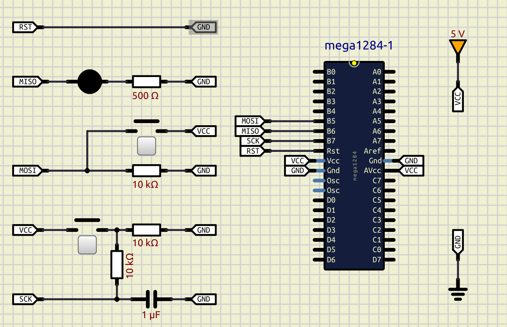

### Почему именно ATmega1284?

- **Функциональнее, чем ATmega328P**: больше выводов, отдельные линии для подключения кварцевого резонатора и сброса.
- **Увеличенный объём памяти**: 128 КБ Flash и 16 КБ SRAM — этого достаточно, чтобы начать работу с **FreeRTOS** и реализовывать более сложные задачи.
- **Простая архитектура AVR**: легко изучать, хорошо документирована, много обучающих материалов и примеров в сети.
- **Используется в курсе [ECE 4760](https://people.ece.cornell.edu/land/courses/ece4760/)** (Корнельский университет), где студенты создают реальные проекты с использованием AVR на C — отличная база для практического обучения.

### Обзор

Краткое описание микроконтроллера можно найти в разделе [**Introduction**](https://ww1.microchip.com/downloads/aemDocuments/documents/MCU08/ProductDocuments/DataSheets/ATmega164A_PA-324A_PA-644A_PA-1284_P_Data-Sheet-40002070B.pdf#G1.2848435).  

### Питание
Первым шагом для знакомства с микроконтроллером - будет подключение питания. В разделе [**1. Pin Configurations**](https://ww1.microchip.com/downloads/aemDocuments/documents/MCU08/ProductDocuments/DataSheets/ATmega164A_PA-324A_PA-644A_PA-1284_P_Data-Sheet-40002070B.pdf#G3.1050997) приведена схема выводов. Следует обратить внимание, что для "здорового" питания должны быть подключены все GND выводы, вывод VCC, а также вывод AVCC, даже если аппаратный узел АЦП не будет задействован (см. [**2.3 Pin Description**](https://ww1.microchip.com/downloads/aemDocuments/documents/MCU08/ProductDocuments/DataSheets/ATmega164A_PA-324A_PA-644A_PA-1284_P_Data-Sheet-40002070B.pdf#G3.2140183)).  

После того, как напряжение питания будет подано, единственным возможным способом убедиться в "работе" микроконтроллера - будет последовательное подключение амперметра в цепь питания. При напряжении питания 5В потребляемый ток будет варьироваться в районе 8мА, если снизить напряжение до 1.8В, то ток снизится до ~400мкА, что будет коррелировать с заявленным значением - Power Consumption at 1MHz, 1.8V, 25C - Active: 0.4mA (см. [**Introduction**](https://ww1.microchip.com/downloads/aemDocuments/documents/MCU08/ProductDocuments/DataSheets/ATmega164A_PA-324A_PA-644A_PA-1284_P_Data-Sheet-40002070B.pdf#G1.2848435)).  

### Состояние пинов

Отлично, первый контакт установлен. Теперь пришло время взять в руки мультиметр и исследовать напряжение на выводах микроконтроллера. Перед измерением вернем напряжение питания равным 5В.  

После выполнения соответствующих измерений, полученные значения занесем в таблицу (см. *pin_voltage.ods*).  

Следует отметить, что большая часть выводов (порт A, B, D частично C) - показывает напряжение в диапазоне (1.0-1.4)В, что является показателем того, что вывод находится в высокоимпедансном состоянии, или иными словами "вывод просто висит в воздухе". Для подтверждения high-Z состояния таких выводов достаточно "подтянуть" любой из них к "земле" (к минусу источника питания), и проверить напряжение еще раз - ожидаемое значение должно быть равным 0В.  

Однако совершенно иначе обстоят дела с выводами PC2, PC3, PC4, и PC5. Вольтметр показывает "высокий" потенциал (напряжение, очень близкое к напряжению питания).  

Объяснение находится здесь: [**25.8.1 MCUCR – MCU Control Register**](https://ww1.microchip.com/downloads/aemDocuments/documents/MCU08/ProductDocuments/DataSheets/ATmega164A_PA-324A_PA-644A_PA-1284_P_Data-Sheet-40002070B.pdf#G3.1435790). По умолчанию интерфейс JTAG - включен и для обслуживания интерфейса задействованы выводы PC2, PC3, PC4, и PC5 в альтернативном режиме ([**14.3.3 Alternate Functions of Port C**](https://ww1.microchip.com/downloads/aemDocuments/documents/MCU08/ProductDocuments/DataSheets/ATmega164A_PA-324A_PA-644A_PA-1284_P_Data-Sheet-40002070B.pdf#G3.1059010)).  

### Подготовка к первому взаимодействию

После небольшого "знакомства" следующим шагом будет попытка первого взаомодейтвия с микроконтроллером. На данном этапе нам не понадобится ни программатор, ни какие-либо программные компоненты или утилиты.  

Ничего нового я не изобретаю, я был вдохновлен вот этим экспериментом: [AVR ISP by hand](https://www.youtube.com/playlist?list=PL6I82vVUc-ThORSCWi0s1OuWWK_hKmQLN). Немного упростив схемотехнику, попробуем повторить то, что было представлено в видео.  

Но сперва предисловие. Один из способов взаимодействия с микроконтроллером является так называемый механизм [ISP](https://en.wikipedia.org/wiki/In-system_programming) (in-system programming). Обратимся к описанию в разделе [**2.1 Block diagram**](https://ww1.microchip.com/downloads/aemDocuments/documents/MCU08/ProductDocuments/DataSheets/ATmega164A_PA-324A_PA-644A_PA-1284_P_Data-Sheet-40002070B.pdf#G3.1051024) - "**... The On-chip ISP Flash allows the program memory to be reprogrammed in-system through an SPI serial interface...**"

Таким образом ISP представляет собой некий "интерфейс" (абстракция) задачей которого является дать возможность пользователю этого интерфейса перезаписать программную память (и даже чуточку больше). Реализация данного интерфейса построена на основе [SPI](https://en.wikipedia.org/wiki/Serial_Peripheral_Interface) (Serial Peripheral Interface) - последовательный синхронный стандарт передачи данных в режиме полного дуплекса.

Пара слов про SPI. Стандарт был разработан компанией Motorola в ранних 1980х. Модель системы выглядит следующим образом:
- есть только одно главное устройство (master/ведущее);
- есть одно или более подчиненное устройство (slave/ведомое);
- есть линия передачи данных от главного устройства - к подчиненному - MOSI (master out - slave in);
- есть линия передачи данных от подчиненного устройствак - к главному - MISO (master in - slave out) ;  
- каждое подчиненное устройство подключено к своей линии выбора CS (chip select);  
- выбор подчиненного устройства осуществляется главным устройством;  
- тактироване (генерация синхроимпульсов) осуществляется главным устройством.  

В сети можно найти немало материалов описывающих стандарт, вот пара ссылок:  
- [Understanding SPI](https://www.youtube.com/watch?v=0nVNwozXsIc) by Rohde & Schwarz;  
- [SPI: The serial peripheral interface](https://www.youtube.com/watch?v=MCi7dCBhVpQ) by Ben Eater.  

Итак, "коммуникационный канал" определен, но какой контракт? Какими данными мы должны обмениваться? Ответы на эти вопросы находятся в разделе [**27.8 Serial downloading**](https://ww1.microchip.com/downloads/aemDocuments/documents/MCU08/ProductDocuments/DataSheets/ATmega164A_PA-324A_PA-644A_PA-1284_P_Data-Sheet-40002070B.pdf#G3.1084032). Мы можем найти схему подключения, алгоритм последовательного программирования, а также список поддерживаемых инструкций (контракт).  

В данном эксперименте мы и наши руки будут "главным" устройством, а микроконтроллер будет - "ведомым". Собререм следующую схему:  

  

Внесем некоторые изменения в нашу существующую схему:  
1. Вывод RESET - замкнем непосредственно на землю (по сути это линия CS) интерфейса SPI;  
2. Вывод MISO - будет источником информации для пользователя, для визуализации данных подключим светодиод к выводу через токоограничивающий резистор;  
3. Вывод MOSI - источник данных для микроконтроллера: используем подтягивающий резистор к земле и кнопку подключенную к питанию;  
4. Вывод SCK - линия тактирования последовательного интерфейса SPI, так как тактирование будет осуществляться вручную пользователем - необходимо применить дополнительный резистор и конденсатор для минимизации дребезга контактов (фильтрация должна осуществляться как по фронту так и по спаду).  

### Вход в режим последовательного программирования. Чтение подписи, фьюзов, калибровочного байта и лок битов.

Теперь обратимся к разделу [**27.9 Serial Programming Instruction set**](https://ww1.microchip.com/downloads/aemDocuments/documents/MCU08/ProductDocuments/DataSheets/ATmega164A_PA-324A_PA-644A_PA-1284_P_Data-Sheet-40002070B.pdf#G3.1084167) и выполним следующие инструкции по чтению разных байтов:  
1. Programming Enable;  
2. Read Signature Byte;
3. Read Lock bits;
4. Read Fuse bits;
5. Read Fuse High bits;
6. Read Extended Fuse Bits;
7. Read Calibration Byte.

Для удобства отслеживания битовых последовательностей и записи инструкций в операционных кодах - отразим необходимую информацию в файле *read_bytes.ods*.  

В общем случае: линия MISO дублирует биты преданные по линии MOSI с отступом (offset) 8 бит, за исключением байтов "возврата" данных.  

### Чтение отдельных байт флеш (программной) памяти

Обратимся к разделам [**8.2 In-System Reprogrammable Flash Program Memory**](https://ww1.microchip.com/downloads/aemDocuments/documents/MCU08/ProductDocuments/DataSheets/ATmega164A_PA-324A_PA-644A_PA-1284_P_Data-Sheet-40002070B.pdf#G3.1052025) и [**27.5 Page Size**](https://ww1.microchip.com/downloads/aemDocuments/documents/MCU08/ProductDocuments/DataSheets/ATmega164A_PA-324A_PA-644A_PA-1284_P_Data-Sheet-40002070B.pdf#G3.2382224).  

Программная память (flash) представлена в виде банка памяти размером 64К машинных слов (конкретный размер зависит от подсемейства микроконтроллера). Согласно архитектуре AVR размер одного машинного слова (WORD) составляет 2 байта (16 бит). Для хранения адреса текущей инструкции используется регистр (ячейка памяти) Program Counter (PC) длиной 16 бит. Ресурс составляет порядка 10000 циклов записи/стирания (чтение не изнашивет).  

Для микроконтроллеров ATmega1284/ATmega1284P регистр PC отражает следующую информацию:  
- биты PC[6:0] - блок одной "страницы" (page) - одна страница хранит 128 (2^7) машинных слов;  
- биты PC[15:7] - отражают номер "страницы" - всего 512 (2^9) страниц.
Итого: банк программной памяти представлен в виде 512 х 128 = 65536 машинных слов, или 65536 х 2 байта = 131072 байта, или 131072 / 1024 = 128Кбайт.   

Выполним чтение программной памяти:  
1. Programming Enable;  
2. Read Program Memory, High byte (address 0x0000);  
3. Read Program Memory, Low byte (address 0x0000);  
4. Read Program Memory, High byte (address 0xFFFF);  
5. Read Program Memory, Low byte (address 0xFFFF);  
6. Read Program Memory, High byte (address 0x0100);  
7. Read Program Memory, Low byte (address 0x0100).  

Для удобства отслеживания битовых последовательностей и записи инструкций в операционных кодах - отразим необходимую информацию в файле *read_flash.ods*.  

Проведенный опыт показал, что во всех трех машинных словах, размещенным в разных участках памяти, записаны одни и теже данные, а именно знвчение 0xFFFF. Можно сделать предположение, что и вся программная память содержит значения 0xFFFF. Но является ли это значение реальной машинной инструкцией, и выполняет ли эту инструкцию микроконтроллер?  
Согласно [**AVR Instruction Set Manual**](https://ww1.microchip.com/downloads/aemDocuments/documents/MCU08/ProductDocuments/ReferenceManuals/AVR-InstructionSet-Manual-DS40002198.pdf) для операционного кода 0xFFFF не существует соответствующей машинной инструкции. Наиболее похожей будет команда [**SBRS – Skip if Bit in Register is Set**](https://ww1.microchip.com/downloads/aemDocuments/documents/MCU08/ProductDocuments/ReferenceManuals/AVR-InstructionSet-Manual-DS40002198.pdf#_OPENTOPIC_TOC_PROCESSING_d2079e41641), но 3й бит должен быть в значении 0. Есть некоторые рассуждения на эту тему - [Running a blank microcontroller - what's actually executing?](https://www.eevblog.com/forum/microcontrollers/running-a-blank-microcontroller-what_s-actually-executing/). Ясно только одно, что сейчас мы ступаем на довольно скользкую тропа, где реальное поведение системы не задокументировано.  
Но можно попытаться спрогнозировать возможное поведение:  
- система даст сбой и вернется в начало исполнения кода (зависание);  
- система будет менять внутреннее состояние непредсказуемым образом (произвольное изменение значений регистров);  
- система пропустит "непонятную" инструкцию и попробует выполнить следующую.  

### Запись во флеш (программную) память  

В рамках следующего эксперимента я хочу попробовать изменить состояние какого-либо из выводов, самый удобный - А0. Идея закоючается в том, чтобы сформировать на этом выводе либо низкий либо высокий потенциал.  

Обратимся к разделу [**14. I/O-Ports**](https://ww1.microchip.com/downloads/aemDocuments/documents/MCU08/ProductDocuments/DataSheets/ATmega164A_PA-324A_PA-644A_PA-1284_P_Data-Sheet-40002070B.pdf#G3.1176988) для краткого обзора портов ввода-вывода. Конфигурация и настройка GPIO (general purpose input-output) осуществляется основным образом через регистры DDRx, PORTx, PINx, которые физически являются набором тумблеров, реализованных на полевых транзисторах и элементах логики, где:  
- DDRx (Data Direction Register) определяет "направление" работы вывода: вход или выход;  
- PORTx (Data Register): если DDRx определен как вход, то установка отдельного бита в 1 подключает внутренний подтягивающий резистор к VCC, в то время как 0 "отключает" вывод от микроконтроллера, переходя в высокоимпедансное состояние (обрыв); если DDRx определен, как выход, то установка отдельного бита в 1 осуществит прямую подтяжку к VCC, в то время, как 0 подтянет напрямую вывод к земле;
- PINx (Input Pins Address) через данный регистр можно "считывать" состояние пина, но есть маленькая тонкость - запись логической единицы в PINx "переключит" (toggle) значение соответствующего бита в PORTx (см. [**14.2.2 Toggling the pin**](https://ww1.microchip.com/downloads/aemDocuments/documents/MCU08/ProductDocuments/DataSheets/ATmega164A_PA-324A_PA-644A_PA-1284_P_Data-Sheet-40002070B.pdf#G3.1057978)).  

Хорошая сводная таблица приведена в [**Table 14-1. Port pin configurations**](https://ww1.microchip.com/downloads/aemDocuments/documents/MCU08/ProductDocuments/DataSheets/ATmega164A_PA-324A_PA-644A_PA-1284_P_Data-Sheet-40002070B.pdf#G3.1057989).

Согласно [**14.3.6 PORTA – Port A Data Register**](https://ww1.microchip.com/downloads/aemDocuments/documents/MCU08/ProductDocuments/DataSheets/ATmega164A_PA-324A_PA-644A_PA-1284_P_Data-Sheet-40002070B.pdf#G3.1059720) и [**14.3.7 DDRA – Port A Data Direction Register**](https://ww1.microchip.com/downloads/aemDocuments/documents/MCU08/ProductDocuments/DataSheets/ATmega164A_PA-324A_PA-644A_PA-1284_P_Data-Sheet-40002070B.pdf#G3.1059807) первоначальные значения в PORTA и DDRA равны 0x00 и 0x00 соответственно, т.е. выводы порта находятся в высокоимпедансном состоянии, что подтверждается опытом измерения напряжения на пинах, выполненным ранее.

Таким образом, последовательная запись логической единицы нулевому биту порта A приведет к тому, что вывод A0 будет последовательно переключаться между высокоимпедансным состоянием и состояние, когда вывод подключен к VCC через подтягивающий резистор.  

Это мне и нужно. Для этого я воспользуюсь инструкцией [6.95 SBI – Set Bit in I/O Register](https://ww1.microchip.com/downloads/aemDocuments/documents/MCU08/ProductDocuments/ReferenceManuals/AVR-InstructionSet-Manual-DS40002198.pdf#_OPENTOPIC_TOC_PROCESSING_d2079e39988). Адрес регистра PINA - 0x00 (см. [**32. Register summary**](https://ww1.microchip.com/downloads/aemDocuments/documents/MCU08/ProductDocuments/DataSheets/ATmega164A_PA-324A_PA-644A_PA-1284_P_Data-Sheet-40002070B.pdf#G3.1357951)).

Операционный код инструкции SBI выглядит следующим образом:  
1001 1010 AAAA Abbb, где:  
- AAAAA - адрес регистра (для PINA - 00000);  
- bbb - номер целевого бита (меня интересует нулевой бит - 000).

С учетом изложенного интересующая машинная инструкция примет вид 1001 1010 0000 0000, или 9A 00.

Выполним запись данной инструкции в программную память по адресу 0x0000:  
1. Programming Enable;  
2. Load Extended Address byte (MSB);  
3. Load Program Memory Page, Low byte;  
4. Load Program Memory Page, High byte;  
5. Write Program Memory Page;  
6. Write Program Memory Page;  
7. Read Program Memory, High byte;  
8. Read Program Memory, Low byte.  

Для удобства отслеживания битовых последовательностей и записи инструкций в операционных кодах - отразим необходимую информацию в файле *write_flash_sbi_0000.ods*.  

После успешной записи уберем перемычку с вывода RESET и подключим осциллограф к выводу А0. Наблюдаем пульсацию с частотой 7.46Hz. Отлично, это хороший знак!  

Можно смело сделать предположение, что контроллер последовательно выполняет записанную команду. Но что насчет "неопределенного" операционного кода FF FF?  

Согласно [**9.2.1 Default Clock Source**](https://ww1.microchip.com/downloads/aemDocuments/documents/MCU08/ProductDocuments/DataSheets/ATmega164A_PA-324A_PA-644A_PA-1284_P_Data-Sheet-40002070B.pdf#G3.1053045) частота работы контроллера составляе 1MHz. Размер программной памяти составляет 65536 машинных слов, первое из которых 9A 00, а остальные - FF FF. Инструкция SBI выполняется за два такта (см. [**33. Instruction set summary**](https://ww1.microchip.com/downloads/aemDocuments/documents/MCU08/ProductDocuments/DataSheets/ATmega164A_PA-324A_PA-644A_PA-1284_P_Data-Sheet-40002070B.pdf#G3.1210001)). Сделаем новое предположение, микроконтроллер в рамках одного такта может "пропускать" машинное слово, если оно не является правильным операционным кодом. Из этого вытекает, что частота выполнения нашей инструкции будет равна:  

Fsbi = (1 000 000 Hz / 65536) / 2, где:  
- 2 - количество переклюений (количество вызовов инструкции SBI) для формирования одного периода);   
- 65536 - количество машинных слов (допустим что все слова будут выполняться зв 1 такт);
- 1000000 - частота контроллера.

Fsbi = 7.62Hz - в пределах погрешности сравнимо с 7.46Hz (внутренняя RC цепь в качестве источника тактирования не самое стабильное решение).

Теперь выполним запись инструкции 9A 00 в программную память, но уже по адресу 0x7FFF:  
1. Programming Enable;  
2. Load Extended Address byte (MSB);  
3. Load Program Memory Page, Low byte;  
4. Load Program Memory Page, High byte;  
5. Write Program Memory Page;  
6. Write Program Memory Page;  
7. Read Program Memory, High byte;  
8. Read Program Memory, Low byte.  

Для удобства отслеживания битовых последовательностей и записи инструкций в операционных кодах - отразим необходимую информацию в файле *write_flash_sbi_7FFF.ods*.  

Частота на выводе А0 возросла в 2 раза и составляет 14.9Hz, что является вполне предсказуемым результатом, т.к. после "модификации" программы период импульса стал в два раза быстрее, и составляет 65536 инструкций вместо (65536 * 2).  

По всей видимости наличие операционных кодов FF FF никак не сказывается на выполнении всей программы. Но! Возможно операционный код FF FF просто обладает недокументированными свойствами, и поэтому система должным образом справляется с ним?  

Для ответа на этот вопрос проведем следующий эксперимент. По уже описанному алгоритму запишем "несуществующую" инструкцию FF FE в адрес 0x0001:  
1. Programming Enable;  
2. Load Extended Address byte (MSB);  
3. Load Program Memory Page, Low byte;  
4. Load Program Memory Page, High byte;  
5. Write Program Memory Page;  
6. Write Program Memory Page;  
7. Read Program Memory, High byte;  
8. Read Program Memory, Low byte.  

Для удобства отслеживания битовых последовательностей и записи инструкций в операционных кодах - отразим необходимую информацию в файле *write_flash_FFFE_0001.ods*.  

Результат - программа работает, показывая предыдущее поведение. Таким образом можно сделать более точный вывод, что КОНКРЕТНЫЙ контроллер при попытке выполнения несуществующего операционного кода просто пропустит его за один машинный такт.  
