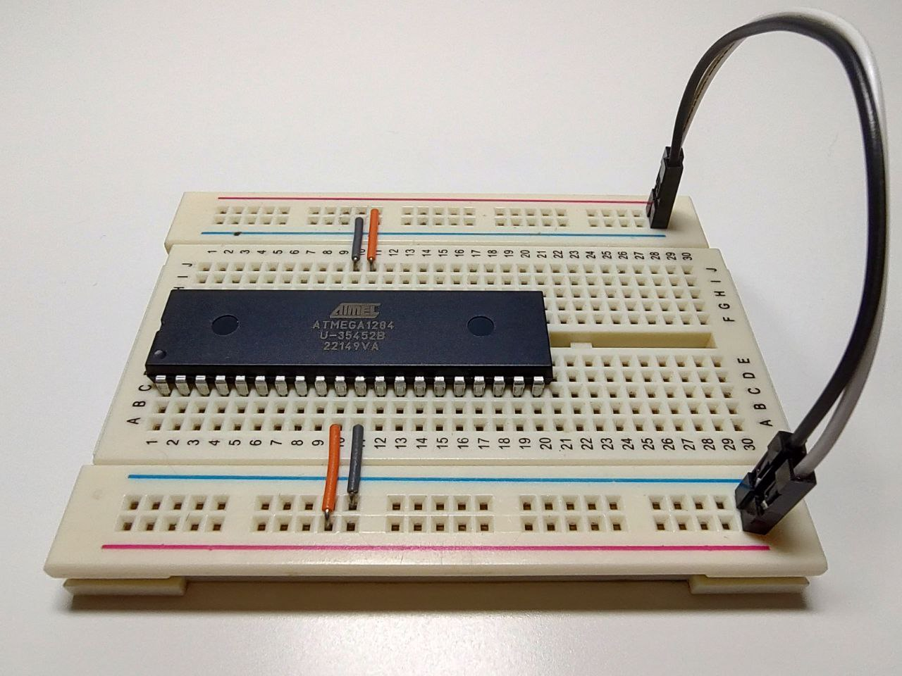

### Power-up  

- The [**1. Pin Configurations**](https://ww1.microchip.com/downloads/aemDocuments/documents/MCU08/ProductDocuments/DataSheets/ATmega164A_PA-324A_PA-644A_PA-1284_P_Data-Sheet-40002070B.pdf#G3.1050997) section provides the pinout diagram.  
- According to the [**2.3 Pin Description**](https://ww1.microchip.com/downloads/aemDocuments/documents/MCU08/ProductDocuments/DataSheets/ATmega164A_PA-324A_PA-644A_PA-1284_P_Data-Sheet-40002070B.pdf#G3.2140183), for a stable power supply all GND pins, the VCC pin, and the AVCC pin must be connected, even if the ADC peripheral is not used.  
- Once the supply voltage is applied, the simplest way to verify that the microcontroller is operating is by measuring its supply current:  
    - With 5.0V - current consumption ~10mA  
    - With 1.8V - current consumption ~400µA  
- The value of 400µA corresponds to the datasheet specification (see [**Introduction**](https://ww1.microchip.com/downloads/aemDocuments/documents/MCU08/ProductDocuments/DataSheets/ATmega164A_PA-324A_PA-644A_PA-1284_P_Data-Sheet-40002070B.pdf#G1.2848435)).  

---

### Pins state  

- Set the supply voltage to 5.0V.  
- Examine the voltage on the microcontroller pins with multimeter, and record the obtained values in the file (*pin_state.ods*).  
- Most of the pins (Ports A, B, D, and partially C) show a voltage in the range of 0.8–1.4V, which indicates that the pin is in a high-impedance (High-Z) state - in other words, the pin is "floating".  
- To confirm the High-Z state of such pins, simply pull any of them down to GND with appropriate resistor (10-20kΩ) and check the voltage again. The expected value should then be 0V.
- Pins PC2, PC3, PC4, and PC5 behave differently, a voltmeter shows a high potential (very close to the supply voltage).  
- By default, the JTAG interface is enabled, and pins PC2–PC5 are used for JTAG functions in alternate mode:  
    - [**14.3.3 Alternate Functions of Port C**](https://ww1.microchip.com/downloads/aemDocuments/documents/MCU08/ProductDocuments/DataSheets/ATmega164A_PA-324A_PA-644A_PA-1284_P_Data-Sheet-40002070B.pdf#G3.1059010)  
    - [**25.8.1 MCUCR – MCU Control Register**](https://ww1.microchip.com/downloads/aemDocuments/documents/MCU08/ProductDocuments/DataSheets/ATmega164A_PA-324A_PA-644A_PA-1284_P_Data-Sheet-40002070B.pdf#G3.1435790)  

---

### Measurement results

| Port / Pin | Measured Voltage | Pin State          |
|------------|------------------|--------------------|
| PA0        | ~0.8–1.4V        | High-Z             |
| PA1        | ~0.8–1.4V        | High-Z             |
| PA2        | ~0.8–1.4V        | High-Z             |
| PA3        | ~0.8–1.4V        | High-Z             |
| PA4        | ~0.8–1.4V        | High-Z             |
| PA5        | ~0.8–1.4V        | High-Z             |
| PA6        | ~0.8–1.4V        | High-Z             |
| PA7        | ~0.8–1.4V        | High-Z             |
| PB0        | ~0.8–1.4V        | High-Z             |
| PB1        | ~0.8–1.4V        | High-Z             |
| PB2        | ~0.8–1.4V        | High-Z             |
| PB3        | ~0.8–1.4V        | High-Z             |
| PB4        | ~0.8–1.4V        | High-Z             |
| PB5        | ~0.8–1.4V        | High-Z             |
| PB6        | ~0.8–1.4V        | High-Z             |
| PB7        | ~0.8–1.4V        | High-Z             |
| PC0        | ~0.8–1.4V        | High-Z             |
| PC1        | ~0.8–1.4V        | High-Z             |
| PC2        | ~5.0V            | Driven High (JTAG) |
| PC3        | ~5.0V            | Driven High (JTAG) |
| PC4        | ~5.0V            | Driven High (JTAG) |
| PC5        | ~5.0V            | Driven High (JTAG) |
| PC6        | ~0.8–1.4V        | High-Z             |
| PC7        | ~0.8–1.4V        | High-Z             |
| PD0        | ~0.8–1.4V        | High-Z             |
| PD1        | ~0.8–1.4V        | High-Z             |
| PD2        | ~0.8–1.4V        | High-Z             |
| PD3        | ~0.8–1.4V        | High-Z             |
| PD4        | ~0.8–1.4V        | High-Z             |
| PD5        | ~0.8–1.4V        | High-Z             |
| PD6        | ~0.8–1.4V        | High-Z             |
| PD7        | ~0.8–1.4V        | High-Z             |

---

### Breadboard  

  

