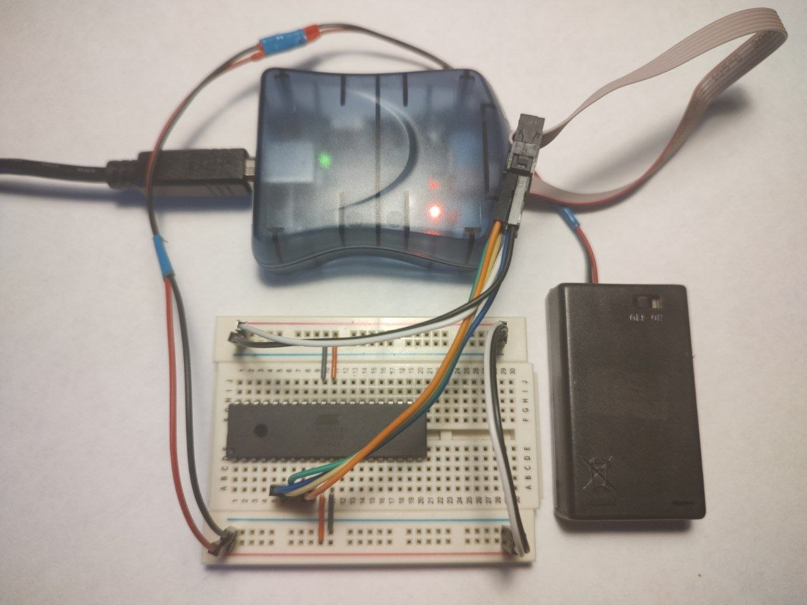
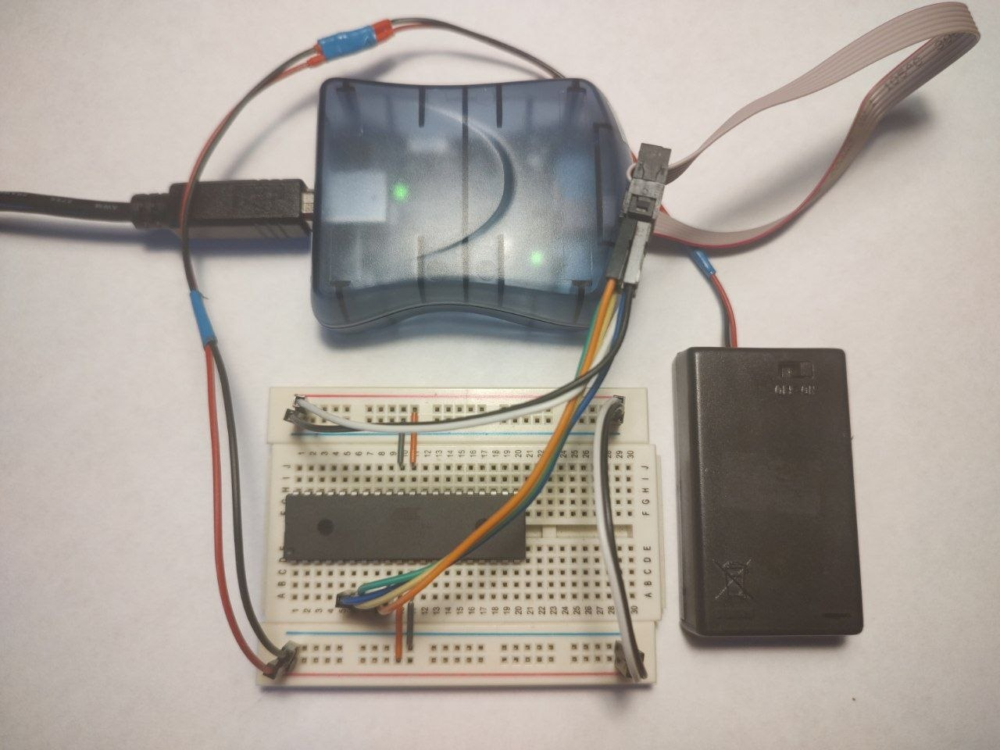

### Prerequisites

- ATmega1284 supports 3 built-in communication channels for memory programming:  
  - [**27.7 Parallel programming**](https://ww1.microchip.com/downloads/aemDocuments/documents/MCU08/ProductDocuments/DataSheets/ATmega164A_PA-324A_PA-644A_PA-1284_P_Data-Sheet-40002070B.pdf#G3.2599024)  
  - [**27.8 Serial downloading**](https://ww1.microchip.com/downloads/aemDocuments/documents/MCU08/ProductDocuments/DataSheets/ATmega164A_PA-324A_PA-644A_PA-1284_P_Data-Sheet-40002070B.pdf#G3.1084032)  
  - [**27.10 Programming via the JTAG Interface**](https://ww1.microchip.com/downloads/aemDocuments/documents/MCU08/ProductDocuments/DataSheets/ATmega164A_PA-324A_PA-644A_PA-1284_P_Data-Sheet-40002070B.pdf#G3.1471568)  
- Classical tool: USBasp - USB programmer for Atmel AVR controllers (see https://www.fischl.de/usbasp/), it works over the SPI (serial peripheral interface).  
- Alternative: AVRISP MKII (see https://www.microchip.com/en-us/development-tool/atavrisp2).  
- After connecting the programmer to a USB port I need to chech the USBasp device: `lsusb`  
- The output should be the following:  
  - *Bus XXX Device YYY: ID 16c0:05dc Van Ooijen Technische Informatica shared ID for use with libusb*  
  - *Bus XXX Device XXX: ID 03eb:2104 Atmel Corp. AVR ISP mkII*
- The 'vendorId:productId' pair should be - *16c0:05dc* or *03eb:2104*  
- To work with binary and hexidecimal files:  
  - `hexdump -C <fileName>` display file contents in hexadecimal, decimal, octal, or ascii  
  - `xxd <fileName>` make a hexdump or do the reverse  
  - `hexedit <fileName>` make a hexdump or do the reverse  
- To install downloader-uploader: `sudo apt install avrdude`  

---

### Breadboard  

Microcontroller without power supply - red led.  
<div align="center">
  
</div>

Microcontroller with power supply - green led.  
<div align="center">
  
</div>

---

### AVRDUDE

- To check connection with the AVR controller:  
`avrdude -c avrispmkII -p m1284` check the connection (execute twice to check for the communication issues)  
`avrdude -c avrispmkII -p m1284 -B 32kHz` set bitclock  
`avrdude -c avrispmkII -p m1284 -B 128kHz -v` verbose output  
`avrdude -c avrispmkII -p m1284 -B 256kHz -vvvvv` max verbose  

- To dump all available memory sections:  
`avrdude -c avrispmkII -p m1284 -vvv -U eeprom:r:eeprom_dump`  
`avrdude -c avrispmkII -p m1284 -vvv -U flash:r:flash_dump` (see http://savannah.nongnu.org/bugs/?44717)  
`avrdude -c avrispmkII -p m1284 -v -U lfuse:r:lfuse_dump`  
`avrdude -c avrispmkII -p m1284 -v -U hfuse:r:hfuse_dump`  
`avrdude -c avrispmkII -p m1284 -v -U efuse:r:efuse_dump`  
`avrdude -c avrispmkII -p m1284 -v -U lock:r:lock_dump`  
`avrdude -c avrispmkII -p m1284 -v -U signature:r:signature_dump`  
`avrdude -c avrispmkII -p m1284 -v -U calibration:r:calibration_dump`  

 - Different file formats:  
`avrdude -c avrispmkII -p m1284 -v -U eeprom:r:eeprom_dump:r`  
`avrdude -c avrispmkII -p m1284 -v -U eeprom:r:eeprom_dump:i` (see https://en.wikipedia.org/wiki/Intel_HEX)  
`avrdude -c avrispmkII -p m1284 -v -U eeprom:r:eeprom_dump:s` (see https://en.wikipedia.org/wiki/SREC_(file_format))  
`avrdude -c avrispmkII -p m1284 -v -U eeprom:r:eeprom_dump:d`  
`avrdude -c avrispmkII -p m1284 -v -U eeprom:r:eeprom_dump:h`  
`avrdude -c avrispmkII -p m1284 -v -U eeprom:r:eeprom_dump:b`  

---

### Fuses

- In AVR microcontrollers, fuses are special non-volatile configuration bits that control hardware settings of the microcontroller. These settings are stored in dedicated fuse registers and determine key aspects like clock source, bootloader behavior, reset settings, and memory protection.
- Fuses are programmed separately from the main flash memory and EEPROM, and they remain unchanged unless explicitly modified using a programmer.  
- AVR fuses cannot be changed at runtime from firmware (code execution).  
- From the previous commands the values of low, high, and extended feuses are:  
  - lfuse: *0x62*;  
  - hfuse: *0x99*;
  - efuse: *0xff*.
- These values correspond the values from [**27.2 Fuse bits**](https://ww1.microchip.com/downloads/aemDocuments/documents/MCU08/ProductDocuments/DataSheets/ATmega164A_PA-324A_PA-644A_PA-1284_P_Data-Sheet-40002070B.pdf#G3.1082557).  

---

### Clock rate

- To see the real clock rate (PORTB1) using the bit CKOUT of fuse low byte (0110 0010 (0x62) -> 0010 0010 (0x22)):  
`avrdude -c avrispmkII -p m1284 -v -U lfuse:w:0x22:m`  
- Output frequency is very close to the 1MHz pulses, but depending on temperature or supply voltage result value may vary. Just for investigation, freez the MCU, then check the real frequency on pin 1 port B, and then heat it, and check the frequency again. Moreover, change the value of supply voltage (of course without exceeding the maximum voltage, see the 'Absolute maximum ratings' in the datasheet).  
- Experiment results:  
  - V = 1.9 volts: f = 974 kHz;
  - V = 2.5 volts: f = [978 ; 981] kHz;
  - V = 3.0 volts: f = [976 ; 981] kHz;
  - V = 4.0 volts: f = [973 ; 977] kHz;
  - V = 5.0 volts: f = [969 ; 971] kHz;
  - V = 5.2 volts: f = [969 ; 971] kHz;
  - t = 28-30 degree Celsius: f = [968 ; 971] kHz;
  - t = -20 degree Celsius: f = ~ 955 kHz;
  - t = ~ 75 degree Celsius: f = ~ 997 kHz;
- Disable the clock prescaler (0010 0010 (0x22) -> 1010 0010 (0xA2)):  
`avrdude -c avrispmkII -p m1284 -v -U lfuse:w:0xA2:m`  
- Using excernal crystal oscillator, configure the controller for full swing oscillator with start-up time 16K CK + 65ms (1010 0010 (0xA2) -> 1011 0111 (0xB7)):  
`avrdude -c avrispmkII -p m1284 -v -U lfuse:w:0xB7:m`  
- Put back initial value:  
`avrdude -c avrispmkII -p m1284 -v -U lfuse:w:0x62:m`  

---

### Opcodes

- Here is a bare metal "Hello World" example without standard AVR libraries, and even without compiler. Only opcodes (pure bare metal)  
- See the [**14.2.2 Toggling the pin**](https://ww1.microchip.com/downloads/aemDocuments/documents/MCU08/ProductDocuments/DataSheets/ATmega164A_PA-324A_PA-644A_PA-1284_P_Data-Sheet-40002070B.pdf#G3.1057978)
- Create the 'firmware.bin' file: `touch firmware.bin`.  
- With **hexedit** add the following instructions: **57 9a 4f 9a ff cf** (static light)  
- Where:  
  - **57 9a** - sbi (DDRD 0x0a; pin 7) - 1001 1010 0101 0111 - 9a 57  
  - **4f 9a** - sbi (PIND 0x09, pin 7) - 1001 1010 0100 1111 - 9a 4f  
  - **ff cf** - rjmp (stay on the current instruction (-1 instruction pointer)) - 1100 1111 1111 1111 - cf ff  
- Use Ctrl + s to save and Ctrl + z to exit  
- Upload the firmware with the following command:  
`avrdude -c avrispmkII -p m1284 -U flash:w:firmware.bin:r`  
- To erease the chip use the next command:  
`avrdude -c avrispmkII -p m1284 -e`  
- With **hexedit** add the following instructions: **57 9a 4f 9a fe cf** (very fast blink)  
- Where:  
  - **57 9a** - sbi (DDRD 0x0a; pin 7)  
  - **4f 9a** - sbi (PIND 0x09, pin 7)  
  - **fe cf** - rjmp (jump to the previous instruction (-2 instruction pointer)) - 1100 1111 1111 1110 - cf fe  
- Read flash right to console in HEX:  
`avrdude -c avrispmkII -p m1284 -U flash:r:-:h`  

```
// asm static lighting  
  0x00:   57 9a           sbi     0x0a, 7 ; 10  
  0x02:   4f 9a           sbi     0x09, 7 ; 9  
  0x04:   ff cf           rjmp    .-2             ; 0x04

// asm fast blink  
  0x00:   57 9a           sbi     0x0a, 7  
  0x02:   4f 9a           sbi     0x09, 7  
  0x04:   fe cf           rjmp    .-4             ; 0x02  
```

---

### Remove AVRDUDE manually installed from sources  

`cd avrdude/build_linux`  
`cat install_manifest.txt`  
`xargs sudo rm -f < install_manifest.txt`  
`which avrdude`  

---

### See also:  
- [AVRDUDE - AVR Downloader/Uploader (old)](https://www.nongnu.org/avrdude/)  
- [AVRDUDE Online Documentation](https://avrdudes.github.io/avrdude/)  
- [AVRDUDE GIT repository](https://github.com/avrdudes/avrdude)  
- [AVRDUDE wiki](https://github.com/avrdudes/avrdude/wiki)  
- [Building AVRDUDE for Linux](https://github.com/avrdudes/avrdude/wiki/Building-AVRDUDE-for-Linux)  
- [Building avrdude Python GUI](https://github.com/avrdudes/avrdude/wiki/Build-avrdude-Python-GUI)  
- [8. AVR memories](https://ww1.microchip.com/downloads/aemDocuments/documents/MCU08/ProductDocuments/DataSheets/ATmega164A_PA-324A_PA-644A_PA-1284_P_Data-Sheet-40002070B.pdf#G3.1184896)  
- [27. Memory programming](https://ww1.microchip.com/downloads/aemDocuments/documents/MCU08/ProductDocuments/DataSheets/ATmega164A_PA-324A_PA-644A_PA-1284_P_Data-Sheet-40002070B.pdf#G3.1182132)  
- [14.2.2 Toggling the pin](https://ww1.microchip.com/downloads/aemDocuments/documents/MCU08/ProductDocuments/DataSheets/ATmega164A_PA-324A_PA-644A_PA-1284_P_Data-Sheet-40002070B.pdf#G3.1057978)  
- [AVR® Instruction Set Manual](https://ww1.microchip.com/downloads/aemDocuments/documents/MCU08/ProductDocuments/ReferenceManuals/AVR-InstructionSet-Manual-DS40002198.pdf)  
- [7.2.1 megaAVR® Devices](https://ww1.microchip.com/downloads/aemDocuments/documents/MCU08/ProductDocuments/ReferenceManuals/AVR-InstructionSet-Manual-DS40002198.pdf#_OPENTOPIC_TOC_PROCESSING_d2079e48916)  
- [SBRS – Skip if Bit in Register is Set](https://ww1.microchip.com/downloads/aemDocuments/documents/MCU08/ProductDocuments/ReferenceManuals/AVR-InstructionSet-Manual-DS40002198.pdf#_OPENTOPIC_TOC_PROCESSING_d2079e41641)  
- [CLR – Clear Register](https://ww1.microchip.com/downloads/aemDocuments/documents/MCU08/ProductDocuments/ReferenceManuals/AVR-InstructionSet-Manual-DS40002198.pdf#_OPENTOPIC_TOC_PROCESSING_d2079e23131)  
- [SBI – Set Bit in I/O Register](https://ww1.microchip.com/downloads/aemDocuments/documents/MCU08/ProductDocuments/ReferenceManuals/AVR-InstructionSet-Manual-DS40002198.pdf)  
- [AVR® Fuse Calculator](https://www.engbedded.com/fusecalc/)  
- [What is the difference between /opt and /usr/local?](https://unix.stackexchange.com/questions/11544/what-is-the-difference-between-opt-and-usr-local)  
- [/usr/bin vs /usr/local/bin on Linux](https://unix.stackexchange.com/questions/8656/usr-bin-vs-usr-local-bin-on-linux)  
