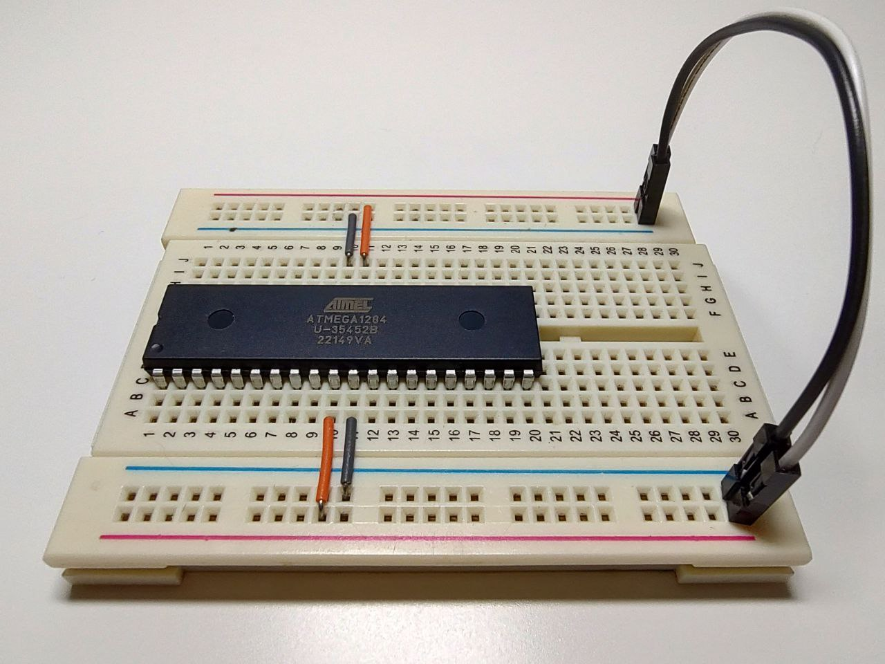

### 🔌 Power up

The first step in getting acquainted with the microcontroller is connecting the power supply.  
The [**1. Pin Configurations**](https://ww1.microchip.com/downloads/aemDocuments/documents/MCU08/ProductDocuments/DataSheets/ATmega164A_PA-324A_PA-644A_PA-1284_P_Data-Sheet-40002070B.pdf#G3.1050997) section provides the pinout diagram.  

⚠️ **Note:** For a stable power supply all **GND** pins, the **VCC** pin, and the **AVCC** pin must be connected, even if the **ADC peripheral** is not used (see [**2.3 Pin Description**](https://ww1.microchip.com/downloads/aemDocuments/documents/MCU08/ProductDocuments/DataSheets/ATmega164A_PA-324A_PA-644A_PA-1284_P_Data-Sheet-40002070B.pdf#G3.2140183)).

---

Once the supply voltage is applied, the simplest way to verify that the microcontroller is operating is by **measuring its supply current**:

- At **5 V** → typically **7–9 mA**  
- At **1.8 V** → about **400 µA**

These values correspond to the datasheet specification (see [**Introduction**](https://ww1.microchip.com/downloads/aemDocuments/documents/MCU08/ProductDocuments/DataSheets/ATmega164A_PA-324A_PA-644A_PA-1284_P_Data-Sheet-40002070B.pdf#G1.2848435)):

> - Power Consumption at 1 MHz, 1.8 V, 25 °C  
>   - Active: 0.4 mA  

---

#### Breadboard:  
 
