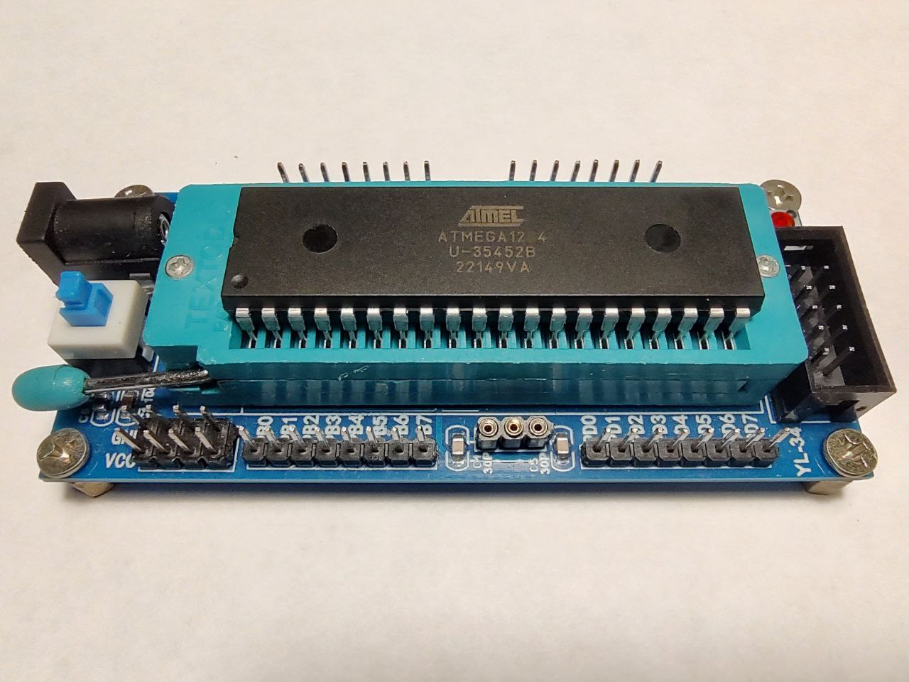

### Evaluation board

- As a minimalistic evaluation (development) board let's switch to the YL-34 (ATmega16 ATmega32 compatible):  
<div align="center">
    
</div>  

- YL-34 circuitry:  
<div align="center">
    
</div>  

- To check connection with the AVR controller:  
 `avrdude -c usbasp-clone -p m1284`  


---

### avr-gcc

- Time to write the simpliest firmware. It is important to keep in safe port's pins, so controlling some electrical parameters is crutual, especially the value of the current. DDRA address is specified in the datasheet. Use the commands below to build the project and play with it.  

- First of all, check that AVR toolchain and downloader-uploader are installed on your local machine, or install them with the command below, and restart the system:  
 `sudo apt install avr-libc binutils-avr gcc-avr`  

- The initial command allows, in one shot, to preprocess, compile, assemble, and link the artifact from the 'main.c' source file:  
 `avr-gcc -mmcu=atmega1284 -Os -Wall -o firmware.elf main.c`  
With the flags applied, we specify the device name, disable compiler optimization, and show all compilation warnings if any occur.  

- In order to display the sizes of sections inside binary files:  
 `avr-size --format=avr --mcu=atmega1284 firmware.elf`  
Two flags applied display info in AVR specific manner with calculation of a free memory space.  

- To upload the firmware to the flash memory:  
 `avrdude -c usbasp-clone -p m1284 -U flash:w:./firmware.elf:e`  

- In order to view assembly listing use the next command:  
 `avr-objdump --disassemble firmware.elf`  

- To erease the chip:  
 `avrdude -c usbasp-clone -p m1284 -e`  

- To remove build artifact use:  
 `rm firmware.elf`  

 ---

 ### Project structure

- For now, let's instroduce a project structure. For this purpose single source file 'main.c' is moved to the 'src' folder, and all the build artifacts will be placed in the 'target' folder (for now it will be only the 'firmware.elf'). To simplify interaction with different commands lets wrap previous commands with appropriate scripts:
  - check.sh;
  - build.sh;  
  - size.sh;  
  - disasm.sh;  
  - upload.sh;  
  - erease.sh;  
  - clean.sh  

- It may need to add permissions for executing the scripts:  
 `chmod +x <fileName.sh>`  

 ---

### Deeper look at the assembly listing  

```assembly
00000000 <__vectors>:
   0:	0c 94 46 00 	jmp	0x8c	; 0x8c <__ctors_end>
   4:	0c 94 50 00 	jmp	0xa0	; 0xa0 <__bad_interrupt>
   8:	0c 94 50 00 	jmp	0xa0	; 0xa0 <__bad_interrupt>
   c:	0c 94 50 00 	jmp	0xa0	; 0xa0 <__bad_interrupt>
  10:	0c 94 50 00 	jmp	0xa0	; 0xa0 <__bad_interrupt>
  14:	0c 94 50 00 	jmp	0xa0	; 0xa0 <__bad_interrupt>
  18:	0c 94 50 00 	jmp	0xa0	; 0xa0 <__bad_interrupt>
  1c:	0c 94 50 00 	jmp	0xa0	; 0xa0 <__bad_interrupt>
  20:	0c 94 50 00 	jmp	0xa0	; 0xa0 <__bad_interrupt>
  24:	0c 94 50 00 	jmp	0xa0	; 0xa0 <__bad_interrupt>
  28:	0c 94 50 00 	jmp	0xa0	; 0xa0 <__bad_interrupt>
  2c:	0c 94 50 00 	jmp	0xa0	; 0xa0 <__bad_interrupt>
  30:	0c 94 50 00 	jmp	0xa0	; 0xa0 <__bad_interrupt>
  34:	0c 94 50 00 	jmp	0xa0	; 0xa0 <__bad_interrupt>
  38:	0c 94 50 00 	jmp	0xa0	; 0xa0 <__bad_interrupt>
  3c:	0c 94 50 00 	jmp	0xa0	; 0xa0 <__bad_interrupt>
  40:	0c 94 50 00 	jmp	0xa0	; 0xa0 <__bad_interrupt>
  44:	0c 94 50 00 	jmp	0xa0	; 0xa0 <__bad_interrupt>
  48:	0c 94 50 00 	jmp	0xa0	; 0xa0 <__bad_interrupt>
  4c:	0c 94 50 00 	jmp	0xa0	; 0xa0 <__bad_interrupt>
  50:	0c 94 50 00 	jmp	0xa0	; 0xa0 <__bad_interrupt>
  54:	0c 94 50 00 	jmp	0xa0	; 0xa0 <__bad_interrupt>
  58:	0c 94 50 00 	jmp	0xa0	; 0xa0 <__bad_interrupt>
  5c:	0c 94 50 00 	jmp	0xa0	; 0xa0 <__bad_interrupt>
  60:	0c 94 50 00 	jmp	0xa0	; 0xa0 <__bad_interrupt>
  64:	0c 94 50 00 	jmp	0xa0	; 0xa0 <__bad_interrupt>
  68:	0c 94 50 00 	jmp	0xa0	; 0xa0 <__bad_interrupt>
  6c:	0c 94 50 00 	jmp	0xa0	; 0xa0 <__bad_interrupt>
  70:	0c 94 50 00 	jmp	0xa0	; 0xa0 <__bad_interrupt>
  74:	0c 94 50 00 	jmp	0xa0	; 0xa0 <__bad_interrupt>
  78:	0c 94 50 00 	jmp	0xa0	; 0xa0 <__bad_interrupt>
  7c:	0c 94 50 00 	jmp	0xa0	; 0xa0 <__bad_interrupt>
  80:	0c 94 50 00 	jmp	0xa0	; 0xa0 <__bad_interrupt>
  84:	0c 94 50 00 	jmp	0xa0	; 0xa0 <__bad_interrupt>
  88:	0c 94 50 00 	jmp	0xa0	; 0xa0 <__bad_interrupt>

0000008c <__ctors_end>:
  8c:	11 24       	eor	r1, r1
  8e:	1f be       	out	0x3f, r1	; 63
  90:	cf ef       	ldi	r28, 0xFF	; 255
  92:	d0 e4       	ldi	r29, 0x40	; 64
  94:	de bf       	out	0x3e, r29	; 62
  96:	cd bf       	out	0x3d, r28	; 61
  98:	0e 94 52 00 	call	0xa4	; 0xa4 <main>
  9c:	0c 94 55 00 	jmp	0xaa	; 0xaa <_exit>

000000a0 <__bad_interrupt>:
  a0:	0c 94 00 00 	jmp	0	; 0x0 <__vectors>

000000a4 <main>:
  a4:	81 e0       	ldi	r24, 0x01	; 1
  a6:	81 b9       	out	0x01, r24	; 1
  a8:	ff cf       	rjmp	.-2      	; 0xa8 <main+0x4>

000000aa <_exit>:
  aa:	f8 94       	cli

000000ac <__stop_program>:
  ac:	ff cf       	rjmp	.-2      	; 0xac <__stop_program>

```

Generated assebly listing contain some code parts such as:  
- `<__vectors>` - interrupt vector table;  
- `<__ctors_end>` - initialization sequence;  
- `<__bad_interrupt>` - pointer for missing ISR;  
- `<main>` - main function;  
- `<_exit>` - disable global interrupts;  
- `<__stop_program>` - stop MCU with infinite loop.  

Review the <\_\_ctors\_end> part that contains next code:  
```assembly
  8c:	11 24       	eor	r1, r1
  8e:	1f be       	out	0x3f, r1	; 63
  90:	cf ef       	ldi	r28, 0xFF	; 255
  92:	d0 e4       	ldi	r29, 0x40	; 64
  94:	de bf       	out	0x3e, r29	; 62
  96:	cd bf       	out	0x3d, r28	; 61
  98:	0e 94 52 00 	call	0xa4	; 0xa4 <main>
  9c:	0c 94 55 00 	jmp	0xaa	; 0xaa <_exit>
```
Breaking it down:  
```assembly
  eor   r1, r1          ; Clear r1
  out   0x3f, r1        ; Clear SREG (status register)
```
Register 0x3f is SREG - the status register, which contains status bits like N, Z, and C, as well as the interrupt enable bit. This code clears the register. The register should already be cleared at reset, but a bootloader or a partial software reset may have left it in an inconsistent state.  
```assembly
  ldi   r28, 0xFF       ; Initialize stack pointer (low byte)
  ldi   r29, 0x40       ; Initialize stack pointer (high byte)
  out   0x3e, r29       ; Set stack pointer (high byte)
  out   0x3d, r28       ; Set stack pointer (low byte)
```
Addresses 0x3d and 0x3e are the high and low portions of the stack pointer. This code initializes the stack pointer to 0x40FF, at the top of RAM. This is, again, identical to the reset state of the processor, so this is more of a precaution than a necessity.  
```assembly
  call  main            ; Call the `main` function
  jmp   _exit           ; Jump to the `_exit` function
```
This calls your main function, then jumps to \_exit (an infinite loop) in case main returns.  

---

### See also:  
- [ATmega164A/PA/324A/PA/644A/PA/1284/P Data Sheet](https://ww1.microchip.com/downloads/aemDocuments/documents/MCU08/ProductDocuments/DataSheets/ATmega164A_PA-324A_PA-644A_PA-1284_P_Data-Sheet-40002070B.pdf)  
- [Section 8 "AVR memories"](https://ww1.microchip.com/downloads/aemDocuments/documents/MCU08/ProductDocuments/DataSheets/ATmega164A_PA-324A_PA-644A_PA-1284_P_Data-Sheet-40002070B.pdf)  
- [Section 14 "I/O-Ports"](https://ww1.microchip.com/downloads/aemDocuments/documents/MCU08/ProductDocuments/DataSheets/ATmega164A_PA-324A_PA-644A_PA-1284_P_Data-Sheet-40002070B.pdf#G3.1176988)  
- [Section 29 "Electrical Characteristics - Absolute Maximum Ratings"](https://ww1.microchip.com/downloads/aemDocuments/documents/MCU08/ProductDocuments/DataSheets/ATmega164A_PA-324A_PA-644A_PA-1284_P_Data-Sheet-40002070B.pdf#G3.2744591)  
- [Section 32 "Register Summary"](https://ww1.microchip.com/downloads/aemDocuments/documents/MCU08/ProductDocuments/DataSheets/ATmega164A_PA-324A_PA-644A_PA-1284_P_Data-Sheet-40002070B.pdf#G3.1357951)  
- [Inline Assembler Cookbook](https://avrdudes.github.io/avr-libc/avr-libc-user-manual-2.2.0/inline_asm.html)  
- [Why is GCC generate the code with bunch of useless JMP instruction?](https://stackoverflow.com/questions/58460085/why-is-gcc-generate-the-code-with-bunch-of-useless-jmp-instruction)  
- [AVR-GCC initialization code](https://electronics.stackexchange.com/questions/383026/avr-gcc-initialization-code)  