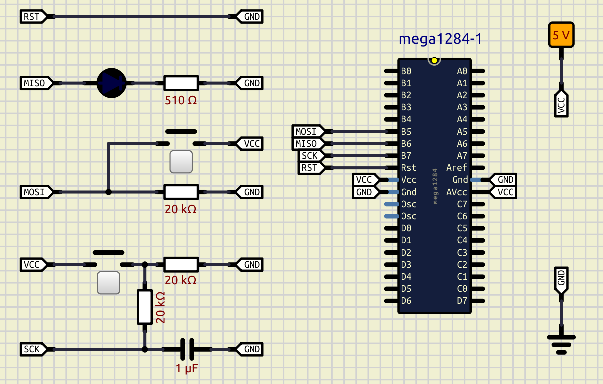
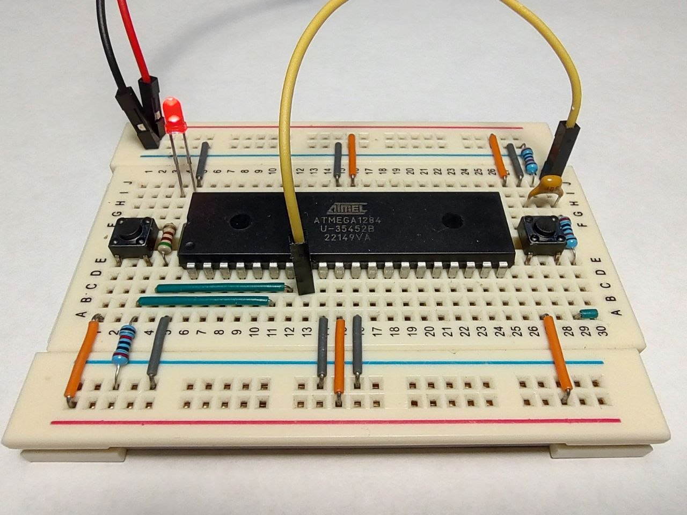
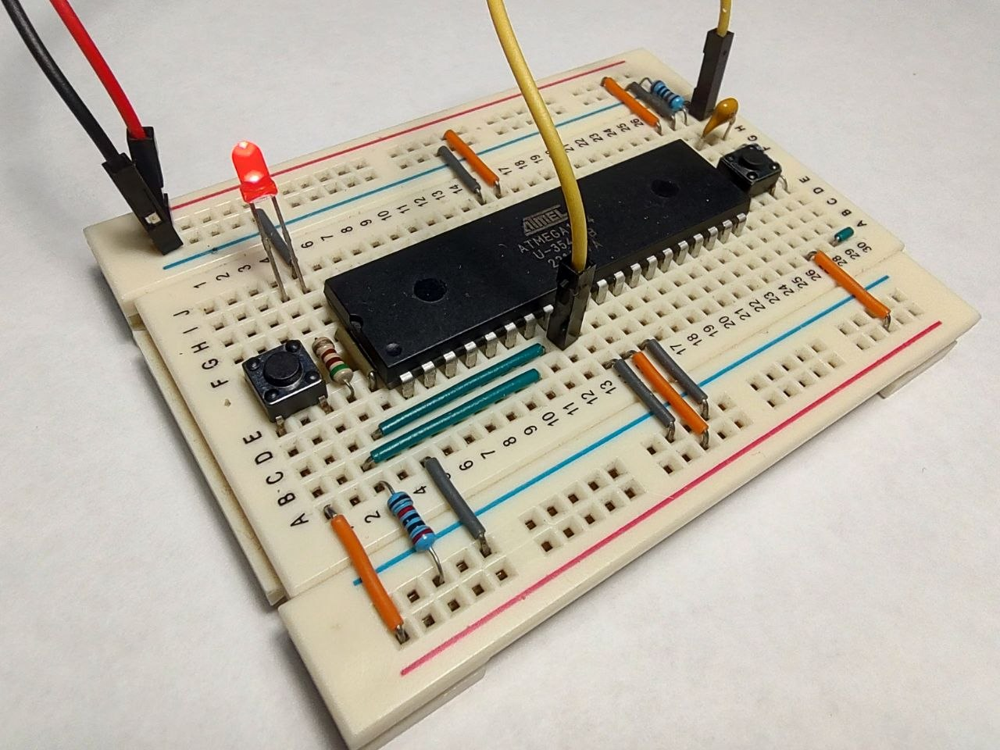
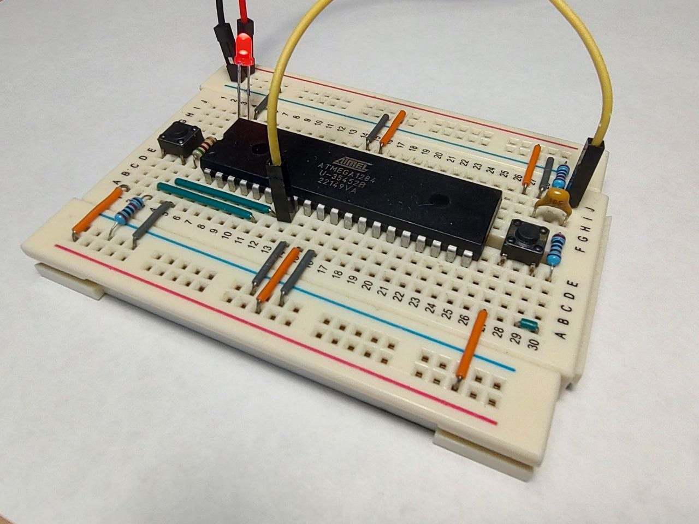

### Serial programming

After a brief “introduction,” the next step will be attempting the first interaction with the microcontroller. At this stage, we will not need a programmer, nor any software components or utilities.

I am not inventing anything new here — I was inspired by this experiment: [AVR ISP by hand](https://www.youtube.com/playlist?list=PL6I82vVUc-ThORSCWi0s1OuWWK_hKmQLN). By slightly simplifying the circuitry, we will try to reproduce what was demonstrated in the video.

But first, some background. One of the ways to interact with a microcontroller is through the so-called [ISP](https://en.wikipedia.org/wiki/In-system_programming) (in-system programming) mechanism. Let us refer to the description in section [2.1 Block diagram](https://ww1.microchip.com/downloads/aemDocuments/documents/MCU08/ProductDocuments/DataSheets/ATmega164A_PA-324A_PA-644A_PA-1284_P_Data-Sheet-40002070B.pdf#G3.1051024)  
```
... The On-chip ISP Flash allows the program memory to be reprogrammed in-system through an SPI serial interface...
```

Thus, ISP represents a kind of “interface” (abstraction) whose purpose is to allow the user of this interface to rewrite the program memory (and even a little more). The implementation of this interface is based on [SPI](https://en.wikipedia.org/wiki/Serial_Peripheral_Interface) (Serial Peripheral Interface) — a synchronous serial communication standard operating in full-duplex mode.

A few words about SPI. The standard was developed by Motorola in the early 1980s. The system model is structured as follows:  
- there is only one master device;  
- there is one or more slave devices;  
- there is a data line from the master device to the slave device — MOSI (Master Out – Slave In);  
- there is a data line from the slave device to the master device — MISO (Master In – Slave Out);  
- each slave device is connected to its own CS (Chip Select) line;
- the master device selects the slave device;  
- clocking (generation of synchronization pulses) is performed by the master device.  

There are many resources online describing the standard; here are a couple of useful links:  
- [Understanding SPI](https://www.youtube.com/watch?v=0nVNwozXsIc) by Rohde & Schwarz;  
- [SPI: The serial peripheral interface](https://www.youtube.com/watch?v=MCi7dCBhVpQ) by Ben Eater.  

So, the “communication channel” is defined — but what about the contract? What data are we supposed to exchange? The answers can be found in section [27.8 Serial downloading](https://ww1.microchip.com/downloads/aemDocuments/documents/MCU08/ProductDocuments/DataSheets/ATmega164A_PA-324A_PA-644A_PA-1284_P_Data-Sheet-40002070B.pdf#G3.1084032). There we can find the connection diagram, the serial programming algorithm, and the list of supported instructions (the contract).

In this experiment, our hands will act as the “master” device, while the microcontroller will act as the “slave.” Let us assemble the following circuit:



We will make several modifications to our existing circuit:  
1. The RESET pin will be connected directly to ground (essentially acting as the CS line of the SPI interface);  
2. The MISO pin will serve as the source of information for the user; to visualize the data, we will connect an LED to the pin through a current-limiting resistor;  
3. The MOSI pin will serve as the data source for the microcontroller: we will use a pull-down resistor connected to ground and a push button connected to VCC;  
4. The SCK pin is the SPI clock line; since clocking will be performed manually by the user, an additional resistor and capacitor must be used to minimize contact bounce (filtering should occur on both rising and falling edges).  







**Stability tips: check contacts (especially for RC button debounce), keep the breadbord on the soft surface (or right in hands), and be calm and patiente!**  

---

### Entering Serial Programming Mode. Reading the Signature, Fuse Bits, Calibration Byte, and Lock Bits (report 1)

Now let us refer to section [27.9 Serial Programming Instruction set](https://ww1.microchip.com/downloads/aemDocuments/documents/MCU08/ProductDocuments/DataSheets/ATmega164A_PA-324A_PA-644A_PA-1284_P_Data-Sheet-40002070B.pdf#G3.1084167) and execute the following instructions to read various bytes:
1. Programming Enable;  
2. Read Signature Bytes;  
3. Read Lock Bits;  
4. Read Fuse Bytes;  
5. Read Calibration Byte.  

To simplify tracking bit sequences and recording instructions in opcode form, the necessary information is summarized in the file *./report/1_read_bytes.ods*.  

In the general case, the MISO line repeats the bits transmitted over MOSI with an offset of 8 bits, except for the actual returned data bytes.  

---

### Reading Individual Bytes from Flash (Program) Memory (report 2)

Let us refer to sections [8.2 In-System Reprogrammable Flash Program Memory](https://ww1.microchip.com/downloads/aemDocuments/documents/MCU08/ProductDocuments/DataSheets/ATmega164A_PA-324A_PA-644A_PA-1284_P_Data-Sheet-40002070B.pdf#G3.1052025) and [27.5 Page Size](https://ww1.microchip.com/downloads/aemDocuments/documents/MCU08/ProductDocuments/DataSheets/ATmega164A_PA-324A_PA-644A_PA-1284_P_Data-Sheet-40002070B.pdf#G3.2382224).  

Program memory (Flash) is organized as a memory bank containing 64K machine words (the exact size depends on the microcontroller family). According to the AVR architecture, one machine word (WORD) is 2 bytes (16 bits) in size. The address of the current instruction is stored in the Program Counter (PC), which is a 16-bit register (memory cell). The endurance is approximately 10,000 write/erase cycles (reads do not cause wear).

For the ATmega1284/ATmega1284P microcontrollers, the PC register reflects the following information:  
- bits PC[6:0] — the offset within a single page; one page stores 128 (2^7) machine words;  
- bits PC[15:7] — the page number; there are 512 (2^9) pages in total.

Thus, the program memory bank consists of:  
- 512 × 128 = 65536 machine words;  
- 65536 × 2 bytes = 131072 bytes;  
- 131072 / 1024 = 128 KB.  

Let us perform several program memory read operations:  
1. Programming Enable;
2. Read Program Memory, High Byte (address 0x0000);  
3. Read Program Memory, Low Byte (address 0x0000);  
4. Read Program Memory, High Byte (address 0x0001);  
5. Read Program Memory, Low Byte (address 0x0001);  
6. Read Program Memory, High Byte (address 0x0002);  
7. Read Program Memory, Low Byte (address 0x0002);  
8. Read Program Memory, High Byte (address 0x0003);  
9. Read Program Memory, Low Byte (address 0x0003);  
10. Read Program Memory, High Byte (address 0xFFFF);  
11. Read Program Memory, Low Byte (address 0xFFFF);  
12. Read Program Memory, High Byte (address 0x0100);  
13. Read Program Memory, Low Byte (address 0x0100).

To simplify tracking bit sequences and recording instructions in opcode form, the necessary information is summarized in the file *./report/2_read_flash.ods*.  

The experiment showed that all three machine words (not related to the firmware itself) are located in different regions of memory (0x0003; 0x0100; 0xFFFF) contain identical data, namely the value 0xFFFF. One may therefore assume that the entire program memory contains the value 0xFFFF. But is this value an actual machine instruction, and does the microcontroller execute it?
According to the [AVR Instruction Set Manual](https://ww1.microchip.com/downloads/aemDocuments/documents/MCU08/ProductDocuments/ReferenceManuals/AVR-InstructionSet-Manual-DS40002198.pdf), there is no corresponding machine instruction for opcode 0xFFFF. The closest match would be the instruction [SBRS – Skip if Bit in Register is Set](https://ww1.microchip.com/downloads/aemDocuments/documents/MCU08/ProductDocuments/ReferenceManuals/AVR-InstructionSet-Manual-DS40002198.pdf#_OPENTOPIC_TOC_PROCESSING_d2079e41641), but the third bit must be 0. There are some discussions on this topic here: [Running a blank microcontroller - what's actually executing?](https://www.eevblog.com/forum/microcontrollers/running-a-blank-microcontroller-what_s-actually-executing/). Only one thing is clear: at this point we are stepping onto rather slippery ground, where the actual system behavior is undocumented.
Still, we may attempt to predict the possible behavior:
- the system crashes and restarts code execution from the beginning (hang/reset);  
- the system changes its internal state unpredictably (arbitrary register modifications);  
- the system skips the “unknown” instruction and attempts to execute the next one.  

---

### Memory erase (report 3)

It turned out that with ISP it is possible to write only '0' (zeroes) to the memory. The opposite - writing '1' ones to the memory where '0' already placed - is impossible.

That is why before uploading the firmware we need to erase the chip first - write '1' ones to flash memory. 

Let us perform flash erase and then several program memory read operations:  
1. Programming Enable;
2. Chip erase;  
3. Read Program Memory, High Byte (address 0x0000);  
4. Read Program Memory, Low Byte (address 0x0000);  
5. Read Program Memory, High Byte (address 0x0001);  
6. Read Program Memory, Low Byte (address 0x0001);  
7. Read Program Memory, High Byte (address 0x0002);  
8. Read Program Memory, Low Byte (address 0x0002).

To simplify tracking bit sequences and recording instructions in opcode form, the necessary information is summarized in the file *./report/3_erase_flash.ods*.  

---

### Writing to Flash (Program) Memory (report 4)

In the next experiment, I want to put back the firmware with static lighting to the program memory (flash). The bit sequence was established in the previous lesson: **57 9a 4f 9a ff cf**.  

Let us perform the firmware upload with the following operations:  
1. Programming Enable;
2. Load Extended Address byte (MSB);  
3. Load Program Memory, Low Byte (address 0x0000);  
4. Load Program Memory, High Byte (address 0x0000);  
5. Load Program Memory, Low Byte (address 0x0001);  
6. Load Program Memory, High Byte (address 0x0001);  
7. Load Program Memory, Low Byte (address 0x0002);  
8. Load Program Memory, High Byte (address 0x0002);  
9. Write Program Memory Page.

To simplify tracking bit sequences and recording instructions in opcode form, the necessary information is summarized in the file *./report/4_write_flash.ods*.  

---

### More info about IO ports

Let us refer to section [14. I/O-Ports](https://ww1.microchip.com/downloads/aemDocuments/documents/MCU08/ProductDocuments/DataSheets/ATmega164A_PA-324A_PA-644A_PA-1284_P_Data-Sheet-40002070B.pdf#G3.1176988) for a brief overview of GPIO ports. GPIO (General Purpose Input/Output) configuration and control are primarily performed through the DDRx, PORTx, and PINx registers, which physically represent sets of switches implemented using MOSFETs and logic elements:  
- DDRx (Data Direction Register) defines whether a pin operates as an input or output;
- PORTx (Data Register): if DDRx configures the pin as an input, setting a bit to 1 enables the internal pull-up resistor connected to VCC, while 0 disconnects the pin from the microcontroller, placing it into a high-impedance state; if DDRx configures the pin as an output, setting a bit to 1 drives the pin directly to VCC, while 0 drives it directly to ground;
- PINx (Input Pins Address) allows reading the state of the pin, but there is a subtle detail: writing a logical 1 to PINx toggles the corresponding bit in PORTx (see the [14.2.2 Toggling the pin](https://ww1.microchip.com/downloads/aemDocuments/documents/MCU08/ProductDocuments/DataSheets/ATmega164A_PA-324A_PA-644A_PA-1284_P_Data-Sheet-40002070B.pdf#G3.1057978)).

A good summary table is provided in [Table 14-1. Port pin configurations](https://ww1.microchip.com/downloads/aemDocuments/documents/MCU08/ProductDocuments/DataSheets/ATmega164A_PA-324A_PA-644A_PA-1284_P_Data-Sheet-40002070B.pdf#G3.1057989).

According to [14.3.6 PORTA – Port A Data Register](https://ww1.microchip.com/downloads/aemDocuments/documents/MCU08/ProductDocuments/DataSheets/ATmega164A_PA-324A_PA-644A_PA-1284_P_Data-Sheet-40002070B.pdf#G3.1059720) and [14.3.7 DDRA – Port A Data Direction Register](https://ww1.microchip.com/downloads/aemDocuments/documents/MCU08/ProductDocuments/DataSheets/ATmega164A_PA-324A_PA-644A_PA-1284_P_Data-Sheet-40002070B.pdf#G3.1059807), the initial values of PORTA and DDRA are both 0x00. In other words, the port pins are initially in a high-impedance state, which is confirmed experimentally by voltage measurements performed earlier.

Thus, repeatedly writing a logical 1 to bit 0 of register PINA will sequentially toggle pin A0 between a high-impedance state and a state where the pin is connected to VCC through the internal pull-up resistor (if DDRA is '0').

This is exactly what I need. For this purpose, I will use instruction [6.95 SBI – Set Bit in I/O Register](https://ww1.microchip.com/downloads/aemDocuments/documents/MCU08/ProductDocuments/ReferenceManuals/AVR-InstructionSet-Manual-DS40002198.pdf#_OPENTOPIC_TOC_PROCESSING_d2079e39988). The address of register PINA is 0x00 (see [32. Register summary](https://ww1.microchip.com/downloads/aemDocuments/documents/MCU08/ProductDocuments/DataSheets/ATmega164A_PA-324A_PA-644A_PA-1284_P_Data-Sheet-40002070B.pdf#G3.1357951)).

The opcode format of the SBI instruction is the following:  
1001 1010 AAAA Abbb, where:  
- AAAAA — register address (00000 for PINA);  
- bbb — target bit number (000 for bit 0).  
