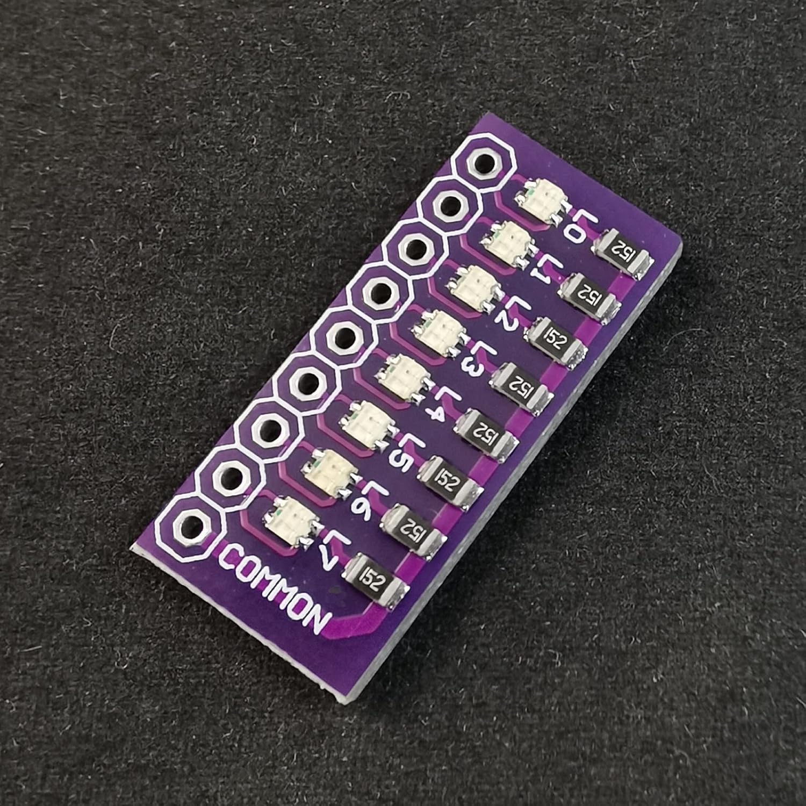

### bte18-10

- 8-bit Port Test Lamp Indicator will be used as a primitive output.

    

  

---

### Type Layout

- The C language provides the four basic arithmetic type specifiers ***char***, ***int***, ***float*** and ***double***, and the modifiers ***signed***, ***unsigned***, ***short***, and ***long***.  Current example allows to show different data type sizes using 8-bit outbut of port D.  

- To minimize manual efforts it is reasonable to automate such routine actions as source file recompilation and firmware uploading using the "make" program. To install it use the:  
 `sudo apt install make`  

- The simpliest Makefile has eight targets:  
  - check - check connection with a chip;  
  - erease - erease chip flash memory;  
  - upload - upload the firmware;  
  - clean - remove all the project artifacts (.elf, .hex, and the 'target' folder);  
  - build - ivoke 'clean' target and perform compilation;  
  - default - reffer to the 'build' target;  
  - disasm - assembly listing;  
  - size - firmware size.  

- To build the current example and upload the firmware use the next commands:  
 `make`  
 `make upload`  

  

|**Data type**                                                      |**Size (bytes)**|
|:------------------------------------------------------------------|:--------------:|
|**char** or **signed char**                                        |1|
|**unsigned char**                                                  |1|
|**int** or **signed int**                                          |2|
|**unsigned int**                                                   |2|
|**long int** or **long signed int** or **long**                    |4|
|**long unsigned int**                                              |4|
|**long long int** or **long long signed int** or **long long**     |8|
|**long long unsigned int**                                         |8|
|**short int** or **short signed int** or **short**                 |2|
|**short unsigned int**                                             |2|
|**float**                                                          |4|
|**double**                                                         |4|
|**long double**                                                    |4|
|**void**                                                           |1|
|**char \***                                                        |2|
|**int \***                                                         |2|
|**long \***                                                        |2|
|**long long \***                                                   |2|
|**float \***                                                       |2|
|**double \***                                                      |2|
|**void \***                                                        |2|  

---

### Endianess: Little

- This means that complex data types with more than 1 byte size stores in memory as a sequence: from LSB to MSB.
Current solution introduces example with two bytes value 576 which has binary representation as [0000 0010] [0100 0000] or (512 + 64).
Where the Most Significant Byte (MSB) will be [0000 0010] and the Least Significant Byte (LSB) will be [0100 0000].  

- For extra investigation:  
  - change the optimization flag to '-O0' (no optimization);  
  - change the optimization flag to '-Os, add 'static inline' keywords before 'void init\_io\_pins(void)', and do the disasm and size again.  

---

### See also:  
- [C data types](https://en.wikipedia.org/wiki/C_data_types "C data types")  
- [GCC Wiki avr-gcc](https://gcc.gnu.org/wiki/avr-gcc#Type_Layout "Type Layout")  
- [Learn Makefiles](https://makefiletutorial.com/)  
- [ASCII](https://en.wikipedia.org/wiki/ASCII)  
- [Endianess](https://en.wikipedia.org/wiki/Endianness "Endianess")  
- [Inline function in C](https://www.geeksforgeeks.org/inline-function-in-c/ "Inline function in C")  
