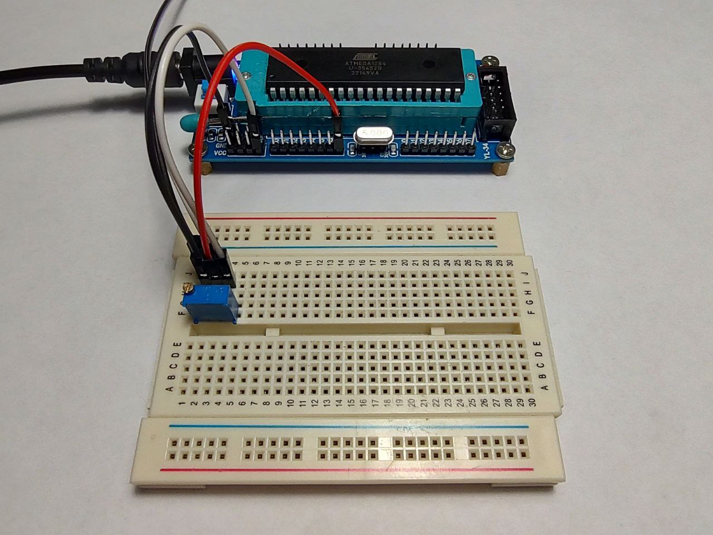
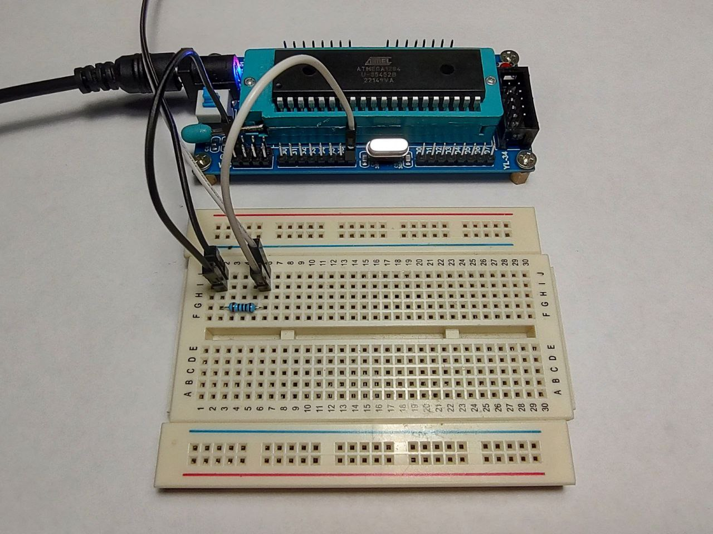

### JTAG disable

- In order to make pins 2, 3, 4, 5 (Port C) as general purpose I need to disable JTAG interface.  
- There are two ways how to do it:  
  - 1st option: disable JTAG during runtime (see the [25.8.1 MCUCR – MCU Control Register](https://ww1.microchip.com/downloads/aemDocuments/documents/MCU08/ProductDocuments/DataSheets/ATmega164A_PA-324A_PA-644A_PA-1284_P_Data-Sheet-40002070B.pdf#G3.1435790));  
  - 2nd option: programming the high fuse with *hfuse:w:0xd9:m* (see the [27.2 Fuse bits](https://ww1.microchip.com/downloads/aemDocuments/documents/MCU08/ProductDocuments/DataSheets/ATmega164A_PA-324A_PA-644A_PA-1284_P_Data-Sheet-40002070B.pdf#G3.1082557)).  
- Let's adjust our 'Makefile' with the target `fuses-jtag-disable`.  

---

### EMI (Electromagnetic interference)  

- It is important to not keep MCU's pins in high-impedance state. Pulling up or pulling down helps to avoid unpredictable pin state or unwanted exposure of electromagnetic interference (also called radio-frequency interference - RFI).  
- In the current example lets keep pin PA7 in the Z-state (high impedance), and the output of PA0 will depend on the PA7 state.  
- **REALTIME:** system's behaviour is unpredictable!!!  
- For extra investigation connect to the PB0 wires with different lengths and check the system behaviour again.  

---

### Schmitt trigger

    

  

- It is important to have a stable power supply for this example!  
- According to the Figure 14-2 in the [14.2 Ports as General Digital I/O](https://ww1.microchip.com/downloads/aemDocuments/documents/MCU08/ProductDocuments/DataSheets/ATmega164A_PA-324A_PA-644A_PA-1284_P_Data-Sheet-40002070B.pdf#G3.1339402) section, each pin has Schnitt trigger.  
- Typical values reflected in the [30.7.9 Pin threshold and hysteresis](https://ww1.microchip.com/downloads/aemDocuments/documents/MCU08/ProductDocuments/DataSheets/ATmega164A_PA-324A_PA-644A_PA-1284_P_Data-Sheet-40002070B.pdf#G3.2093201).  
- Examine the voltage on the microcontroller pins with multimeter for transitions between LOW to HIGH, and HIGH to LOW input states (with Vcc = 5V):  

| Port / Pin | HIGH Threshold Voltage | LOW Threshold Voltage |
|------------|------------------------|-----------------------|
| PB0        | ~2.37V                 | ~2.23V                |
| PB7        | ~2.43V                 | ~2.17V                |
| PA7        | ~2.39V                 | ~2.19V                |

---

### GPIO internal resistance

    

  

- It is important to have a stable power supply for this example!  
- [Section 29 "Electrical Characteristics - Absolute Maximum Ratings"](https://ww1.microchip.com/downloads/aemDocuments/documents/MCU08/ProductDocuments/DataSheets/ATmega164A_PA-324A_PA-644A_PA-1284_P_Data-Sheet-40002070B.pdf#G3.2744591)  
- Preliminary calculation:  
  - $Vcc = 5V;$  
  - $Imax = 0.040A;$  
  - $Rmin = \frac{Vcc}{Imax} = \frac{5}{0.040} = 125Ω$
- Effective values:  
  - $Rload = 197Ω;$  
  - $Vcc = Vout = 5.20V;$  
  - $\frac{Vload}{Rload} = \frac{Vinternal}{Rinternal};$  
  - $Rinternal =  \frac{Rload * Vinternal}{Vload}$
- Measurement results (*pin_state.ods*):  

| Port / Pin | R internal |
|------------|------------|
| PB0        | 25.2Ω      |
| PB7        | 23.7Ω      |
| PA7        | 23.7Ω      |

---

### Notes:

- p-channel mosfet - with ring on gate (logical 0 - open);  
- n-channel mosfet - witout ring on gate (logical 1 - open).  

---

### See also:  

- [EMI](https://en.wikipedia.org/wiki/Electromagnetic_interference)  
- [C - goto](https://www.geeksforgeeks.org/goto-statement-in-c/)  
- [Schmitt trigger](https://en.wikipedia.org/wiki/Schmitt_trigger)  
- [Difference Between Digital Latch and Flip-Flop Circuits](https://www.electricaltechnology.org/2024/06/difference-between-latch-flip-flop.html)  
- [The “Buffer” Gate](https://www.allaboutcircuits.com/textbook/digital/chpt-3/buffer-gate/)  
- [What is the difference between a tristate buffer and a transmission gate?](https://electronics.stackexchange.com/questions/692525/what-is-the-difference-between-a-tristate-buffer-and-a-transmission-gate)  
- [CMOS Transmission Gate](https://www.nationin.com/post/cmos-transmission-gate?srsltid=AfmBOopPHoOmWCf0OXBNlVbCMaUickfIUB-51H-9XsYkpUCyKUpS325r)  
