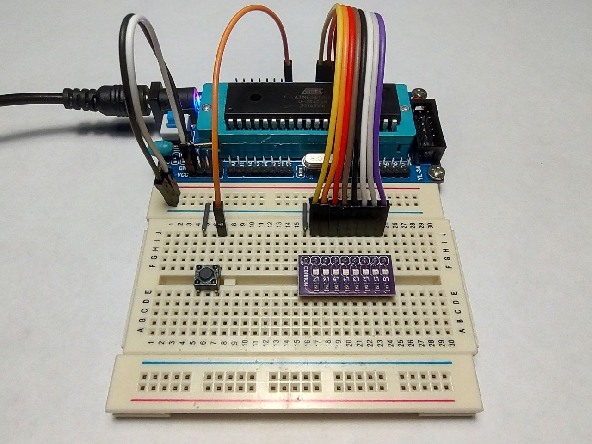
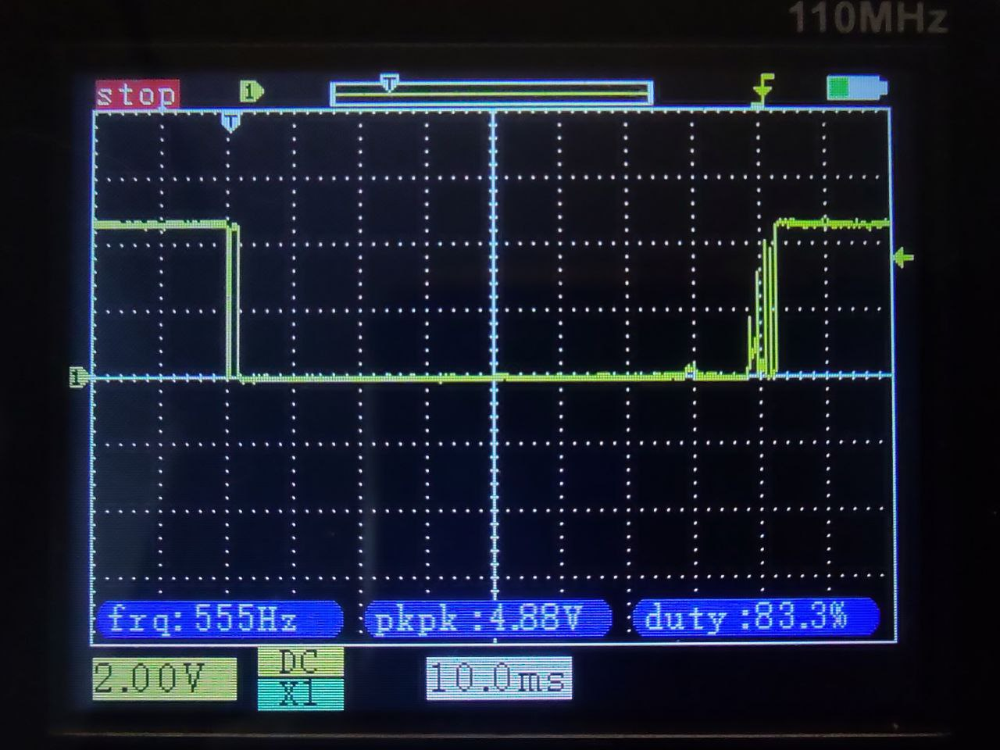
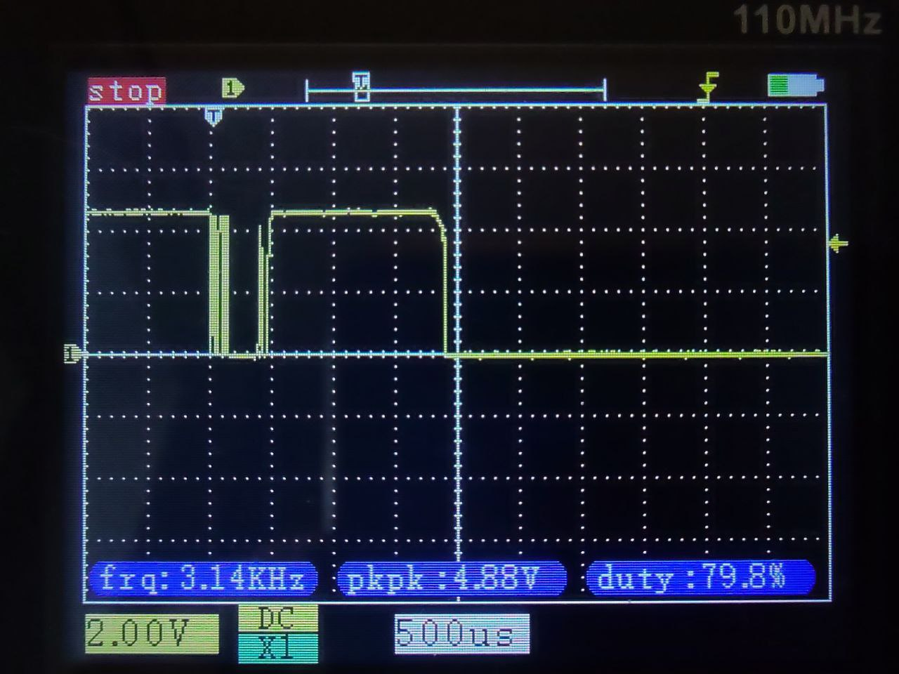
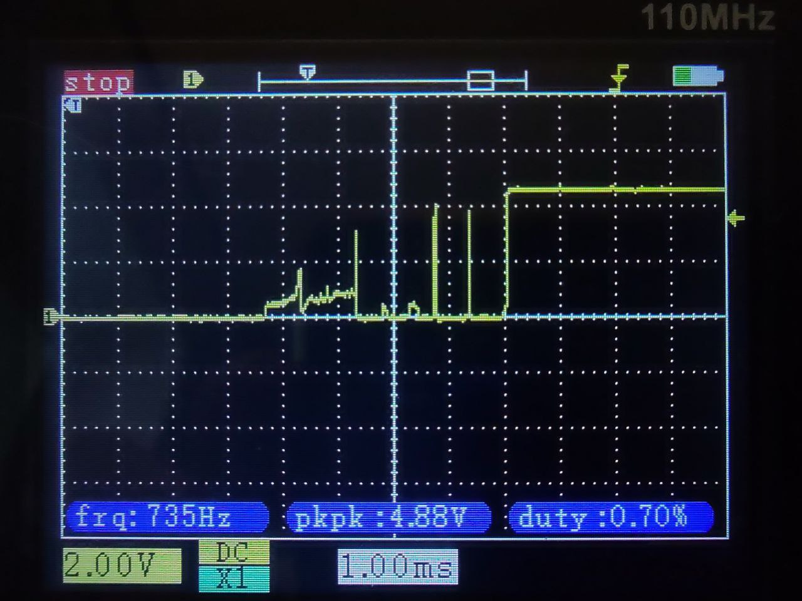
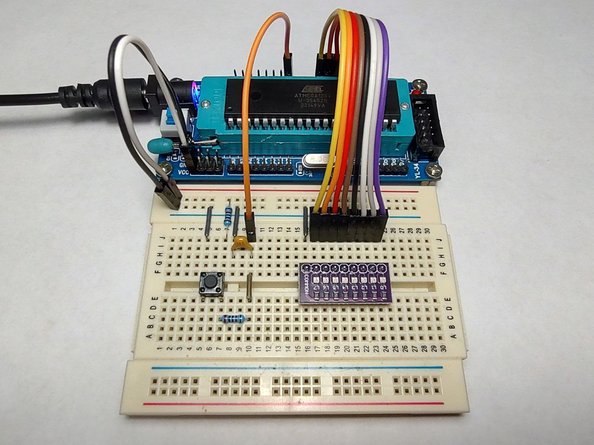
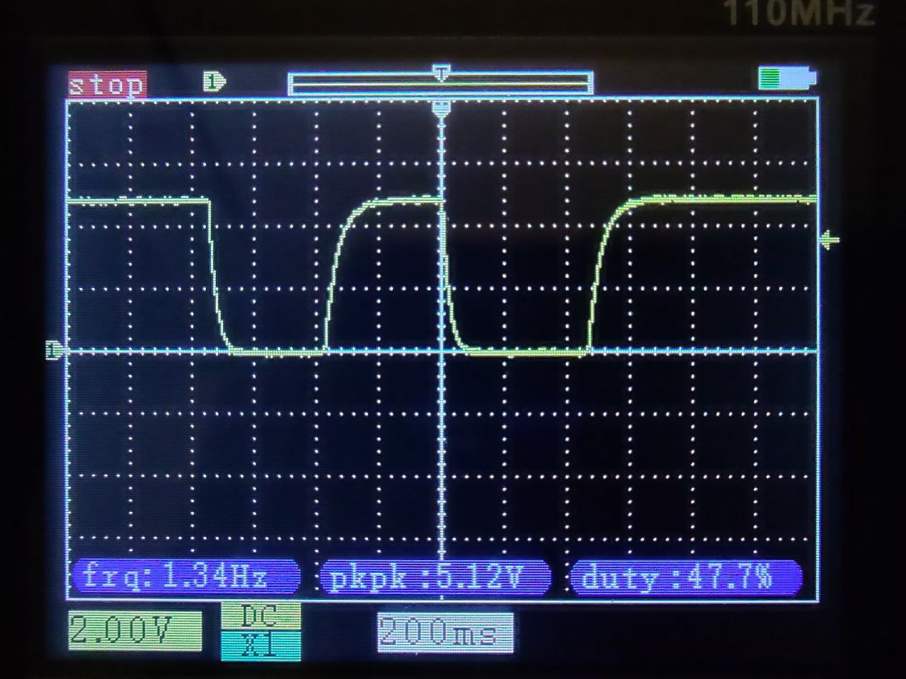
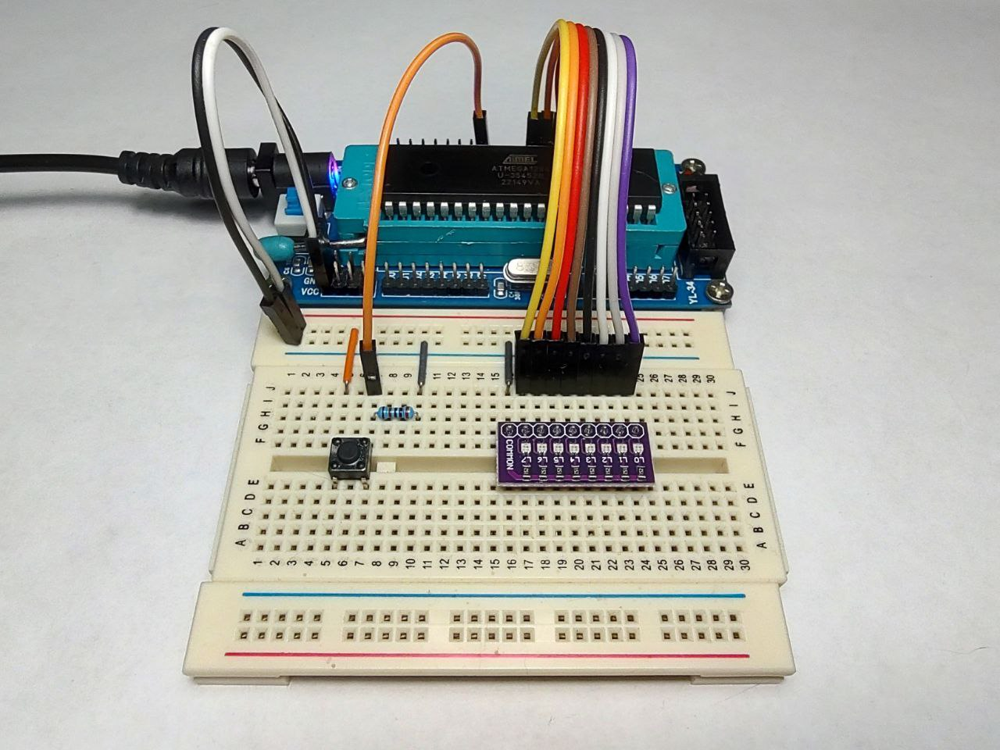
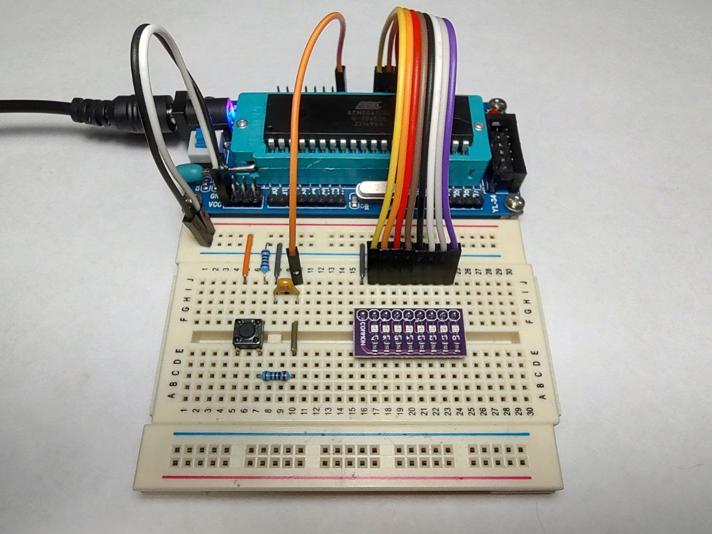
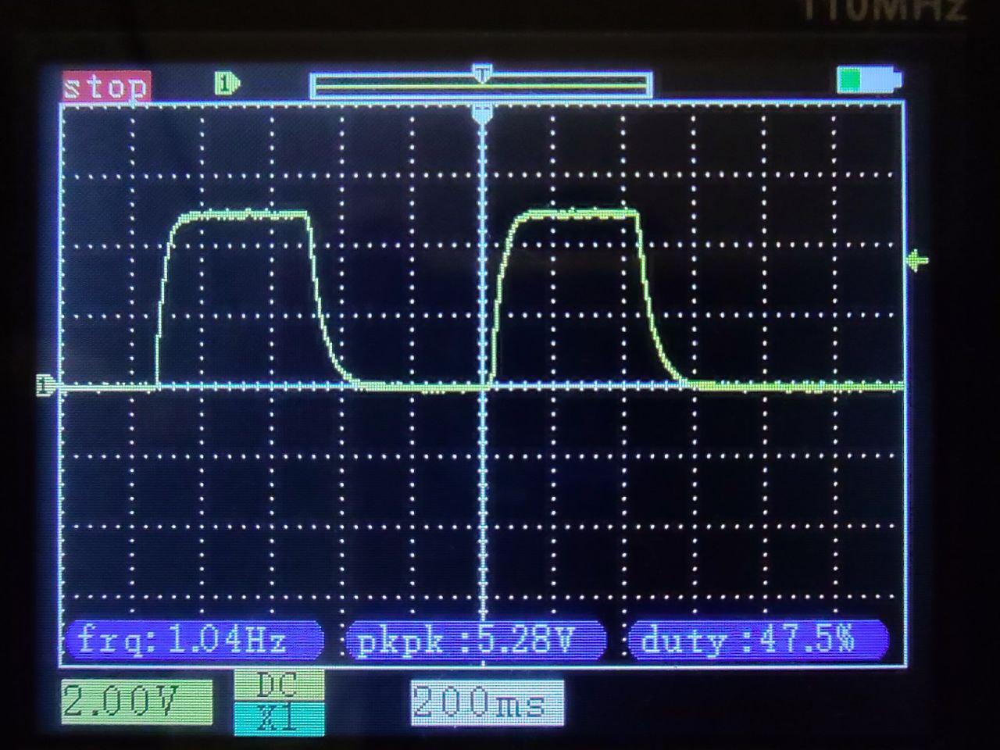

### Button, bounce, RC

- This section contains several examples with button handling, contact bounce, hardware debounce solution with RC circuit, and EMI (electromagnetic interference).  
- According to the sections [28.1 DC Characteristics](https://ww1.microchip.com/downloads/aemDocuments/documents/MCU08/ProductDocuments/DataSheets/ATmega164A_PA-324A_PA-644A_PA-1284_P_Data-Sheet-40002070B.pdf#G3.2906115) and [29.1 DC Characteristics](https://ww1.microchip.com/downloads/aemDocuments/documents/MCU08/ProductDocuments/DataSheets/ATmega164A_PA-324A_PA-644A_PA-1284_P_Data-Sheet-40002070B.pdf#G3.2744908) of the datasheet the resistance of internal pull-up resistor is about [20; 50]kΩ.  
- IMPORTANT! Examples 03, 04, 05 and 06 are EMI sensitive.  
- In conditions of strong electromagnetic interference, you need to reduce the resistance of the pull-up / pull-down resistor.  
- Increasing the resistance of pull-up / pull-down resistor reduces power consumption.  
- Default resistance of pull/up / pull-down resostor 20kΩ (10kΩ or 1kΩ - in case of strong EMI).  

---

### Example 01 - INTERNAL PULL-UP resistor is used  

  

- The start is fine, several hits on the button are accompanied by a bounce.  

---

### Example 02 - Software debounce

  

  

  

- The main idea is to increace a time between button pin state cheks. In the current example delay() is used for software debounce, but ideally we should use the button state machine, and hardware timer interrupts to make it non-blocking.  
- The start is fine, several hits on the button are not accompanied by a bounce.  

---

### Example 03 - EXTERNAL PULL-UP resistor is used, R = 20kΩ  

  

- The start is fine, several hits on the button are accompanied by a bounce, ignoring the pull-up resistor leads to the high-impedance state of a button pin, and LEDs start to blink randomly until button will be pushed.  

---

### Example 04 - EXTERNAL PULL-UP resistor is used, R = 20kΩ; R = 20kΩ and C = 1µF (105) is used for debouncing  

  

  

- The start is fine, RC circuit for debounce is fine, ignoring the pull-up resistor leads to the high-impedance state of a button pin, and LEDs start to blink randomly until button will be pushed.  

---

### Example 05 - EXTERNAL PULL-DOWN resistor is used, R = 20kΩ  

  

- The start is fine, several hits on the button are accompanied by a bounce, ignoring the pull-up resistor leads to the high-impedance state of a button pin, and LEDs start to blink randomly until button will be pushed.  

---

### Example 06 - EXTERNAL PULL-DOWN resistor is used, R = 20kΩ; R = 20kΩ and C = 1µF (105) is used for debouncing  

  

  

- The start is fine, RC circuit for debounce is fine, ignoring the pull-down resistor leads to the high-impedance state of a button pin, and LEDs start to blink randomly until button will be pushed.  

---

### See also:  

- [SimulIDE Circuit Simulator](https://simulide.com/p/)  
- [RC circuit](https://en.wikipedia.org/wiki/RC_circuit)  
- [RC time constant](https://en.wikipedia.org/wiki/RC_time_constant)  
- [11 Myths About Switch Bounce/Debounce](https://www.electronicdesign.com/technologies/analog/article/21155418/logiswitch-11-myths-about-switch-bouncedebounce)  
- [A Guide to Debouncing](https://my.eng.utah.edu/~cs5780/debouncing.pdf)  
- [Debounce a Switch](https://www.youtube.com/watch?v=e1-kc04jSE4&t)  
- [EMI](https://en.wikipedia.org/wiki/Electromagnetic_interference)  
