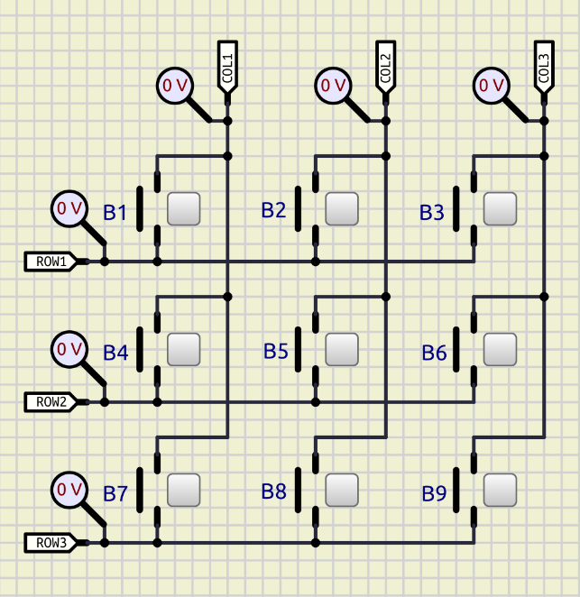
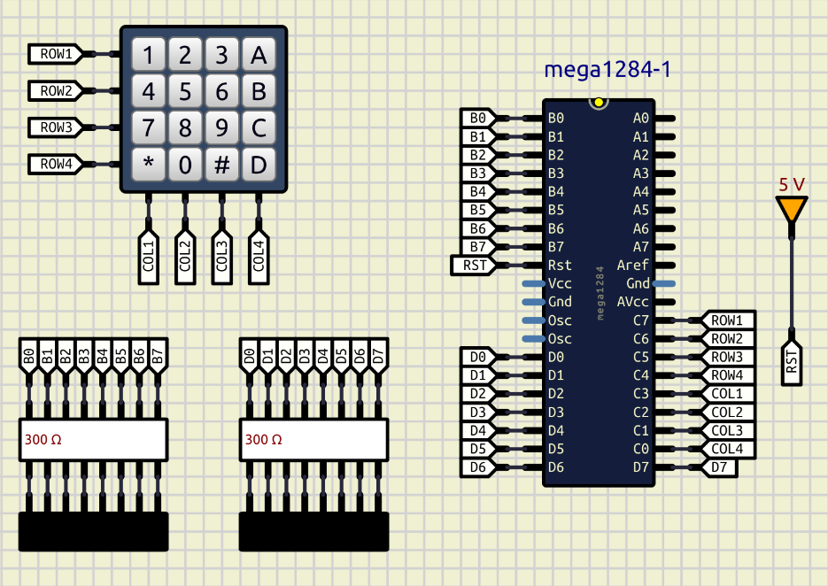

### Keyboard matrix

- There are two ways how to perform the matrix keyboard scanning:
  1. Per key scanning:  
     - check each column of each row (row - column flow);  
     - check eack row of each column (column - row flow);  
  2. Creating the pins snapshot state (bidirectional scan):  
     - row - column bit mask;  
     - column - row bit maks.  

- The *simulation* folder contains two circuitries: concept for understanding the matrix keyboard scan principles, and simulation for microcontroller and 4x4 matrix keyboard.  

  

  

     
---

### See also:  

- [Keyboard matrix circuit](https://en.wikipedia.org/wiki/Keyboard_matrix_circuit)  
- [NKRO, KRO, #KRO, 6KRO и Ghosting](https://wiki.geekboards.ru/all/nkro-and-ghosting/)  
- [Keyboard Ghosting Test](https://www.xbitlabs.com/keyboard-ghosting-test/)  
