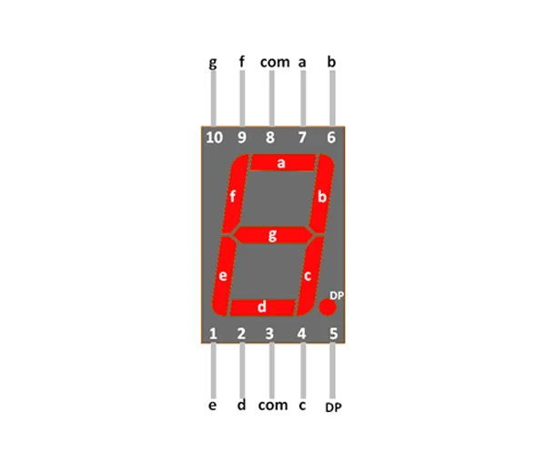
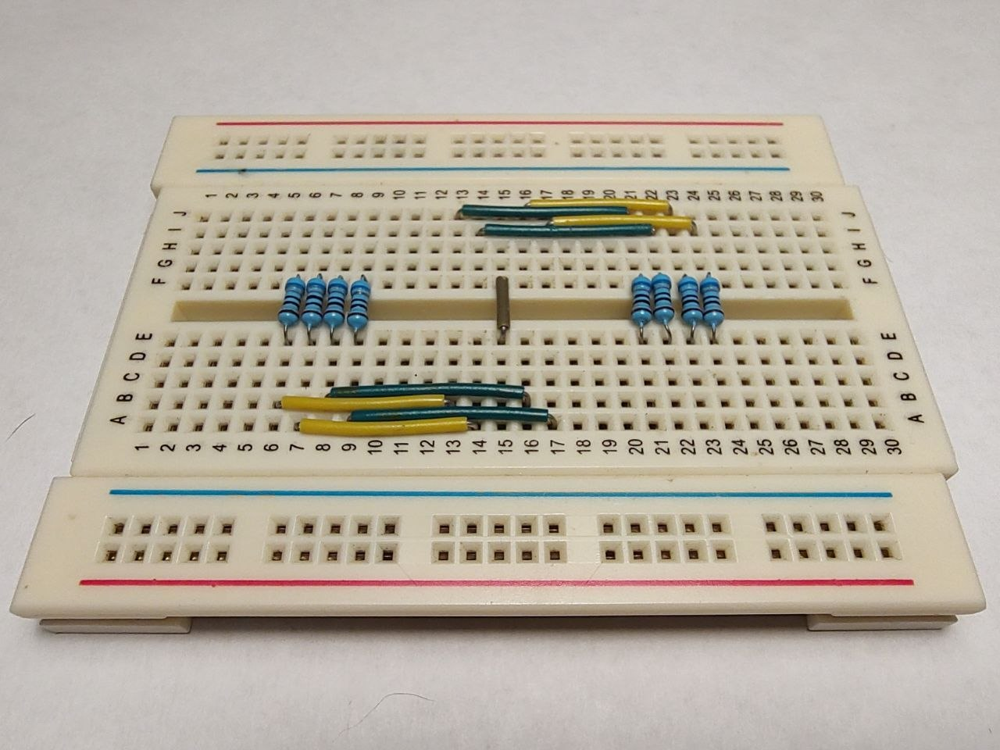
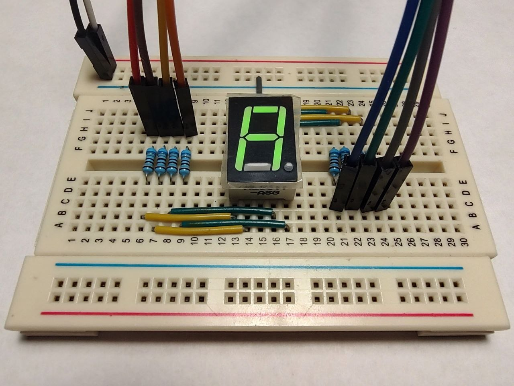
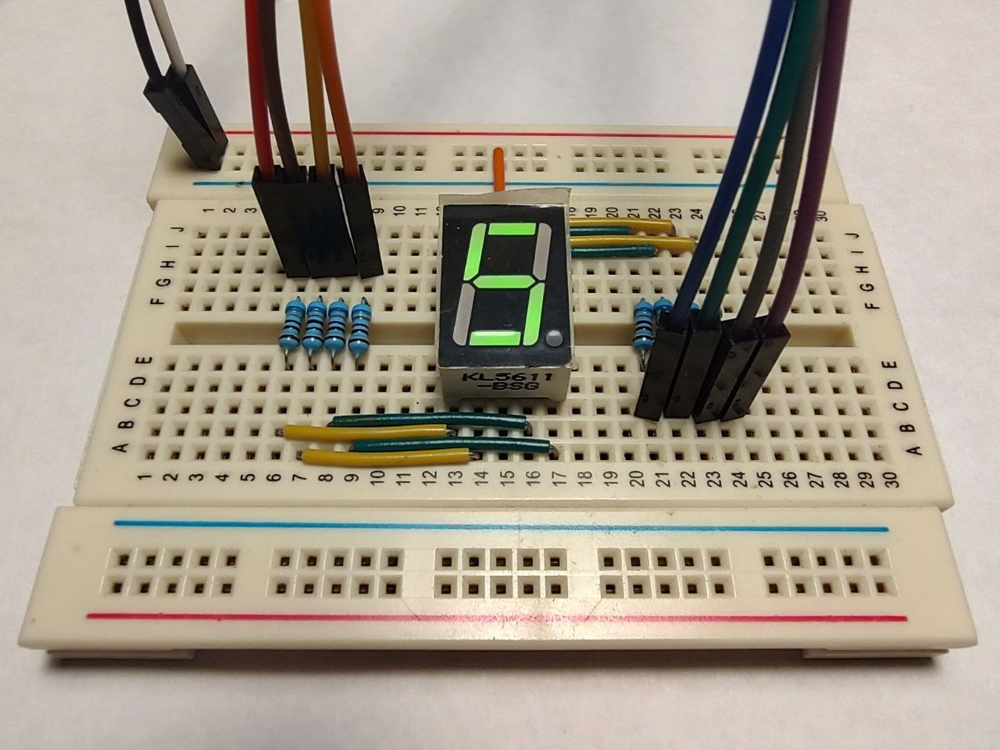

### Seven segment display, pin configuration 
  
<div align="center">
    
</div>  

--- 

### Initial circuitry  

<div align="center">
    
</div>  

---

### Common cathode (CC)  

<div align="center">
    
</div>  

---

### Common anode (CA)  

<div align="center">
    
</div>  

---

### MAKEFILE disasm info adjustment

Let's adjust MAKEFILE for 'disasm' step:  
```
disasm: ./target/$(DESTINATION).elf
	@avr-objdump -h ./target/$(DESTINATION).elf
	@avr-objdump -d ./target/$(DESTINATION).elf
	@avr-objdump -s -j .data ./target/$(DESTINATION).elf
```
or  
```
disasm: ./target/$(DESTINATION).elf
	@avr-objdump --section-headers ./target/$(DESTINATION).elf
	@avr-objdump --disassemble ./target/$(DESTINATION).elf
	@avr-objdump --full-contents --section=.data ./target/$(DESTINATION).elf
```

Default linker script AVR-LibC (see the [Memory Regions](https://avrdudes.github.io/avr-libc/avr-libc-user-manual-2.3.0/mem_sections.html#sec_memory_regions)):  

<div align="center">

| Region         |    ELF VMA |
| -------------- | ---------: |
| Flash / `text` | `0x000000` |
| SRAM / `data`  | `0x800000` |
| EEPROM         | `0x810000` |
| Fuse           | `0x820000` |
| Lock           | `0x830000` |
| Signature      | `0x840000` |

</div>

- VMA - Virtual Memory Address  
- LMA - Load Memory Address  

---

### See also:  

- [Segment dispaly](https://en.wikipedia.org/wiki/Segment_display)  
- [7 Segment Displays Complete Guide](https://microcontrollerslab.com/7-segment-display-pinout-working-examples-applications/)  
- [How Seven Segment Display Works & Interface it with Arduino](https://lastminuteengineers.com/seven-segment-arduino-tutorial/)  
- [Memory Sections ](https://avrdudes.github.io/avr-libc/avr-libc-user-manual-2.3.0/mem_sections.html)  
- [The .text Output Section](https://avrdudes.github.io/avr-libc/avr-libc-user-manual-2.3.0/mem_sections.html#sec_dot_text)  
