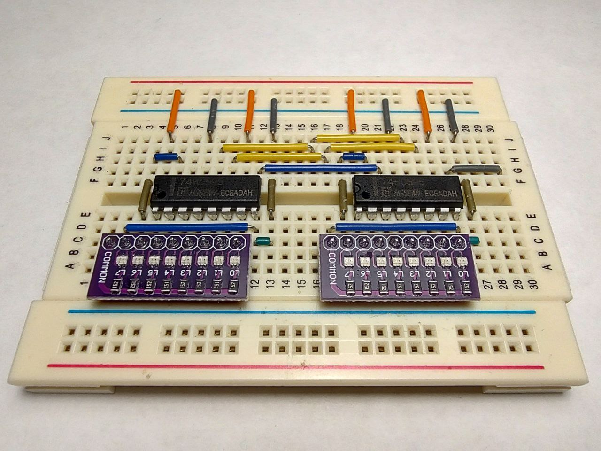

### Shift register 74HC595

- To minimize the pins number required for data visualizing it is possible to convert parallel output into serial output with the shift registers.  
- Two shift registers are used for experiments, see the circuitry photo:

<div align="center">
  
</div>

- TO VERIFY LATER - According to the datasheet:  
```
Both the shift register clock (SRCLK) and storage register clock (RCLK) are positive-edge triggered. If both clocks are connected together, the shift register always is one clock pulse ahead of the storage register.
```

- The statement is not reproducible with the HGSEMI shift register!  

---

### See also:  

- [SNx4HC595 8-Bit Shift Registers With 3-State Output Registers](https://www.ti.com/lit/ds/symlink/sn74hc595.pdf)  
- [74HC595; 74HCT595 8-bit serial-in, serial or parallel-out shift register with output latches](https://assets.nexperia.com/documents/data-sheet/74HC_HCT595.pdf)  
- [74HC595 HGSEMI](https://www.tinytronics.nl/product_files/000174_HGSEMI_74HC595_Datasheet.pdf)  
- [Pseudorandom number generator](https://en.wikipedia.org/wiki/Pseudorandom_number_generator)  
- [Linear-feedback shift register (LFSR)](https://en.wikipedia.org/wiki/Linear-feedback_shift_register)  
- [ECE 4760: Laboratory 3 - white noise](https://people.ece.cornell.edu/land/courses/ece4760/Math/GCC644/DDS/DDS_sine_noise_uart.c)
