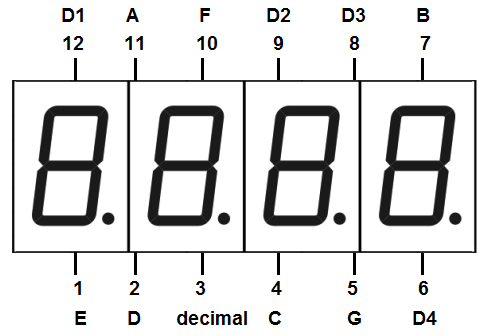
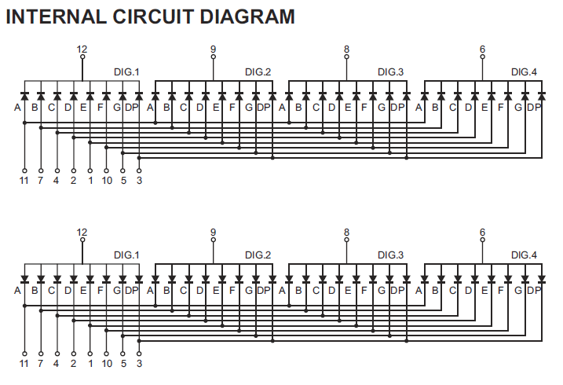
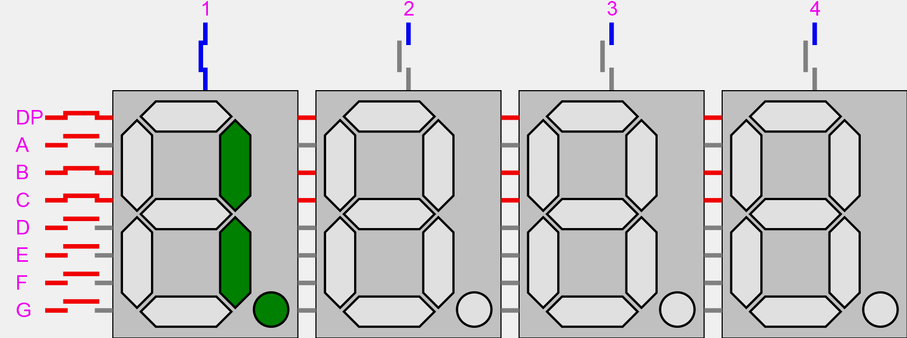

### Four digit seven segment display, pin configuration 
  

    

  

--- 

### Circuitry  

    

  

---

### Dynamic lighting (multiplexing) 

    

  

---

### Just notes

- See the video *./extra/breadboard.mp4*;  
- Use *../init_project.sh*.  

---

### See also:  

- [Segment dispaly](https://en.wikipedia.org/wiki/Segment_display)  
