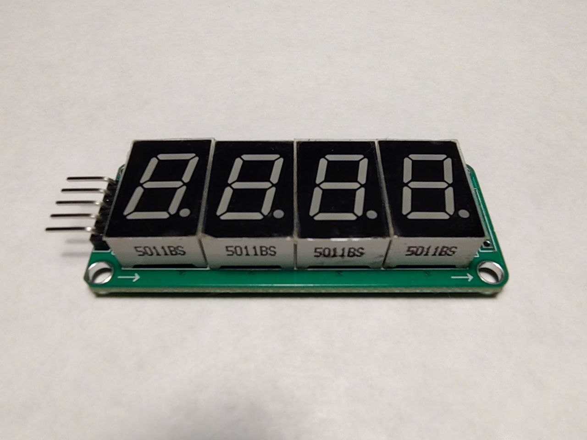
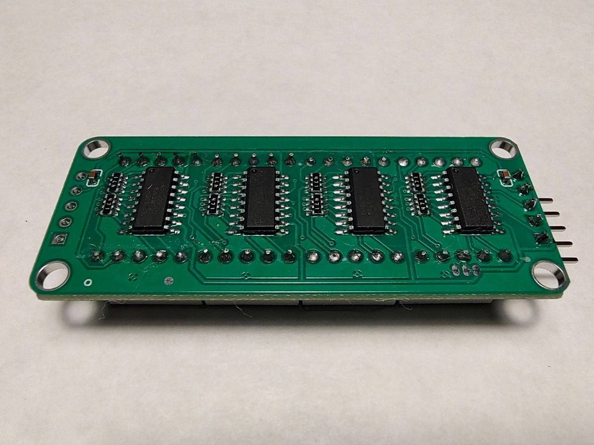
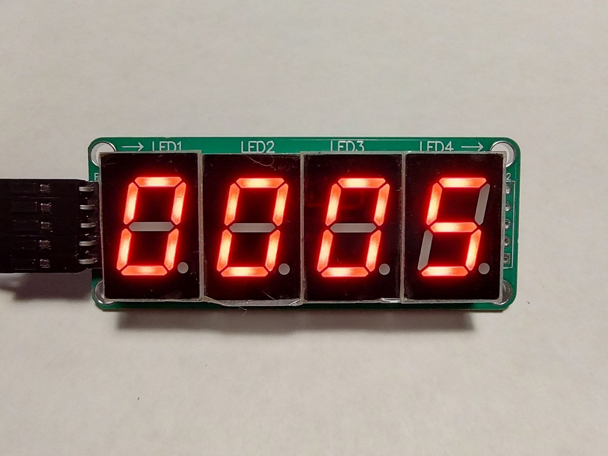
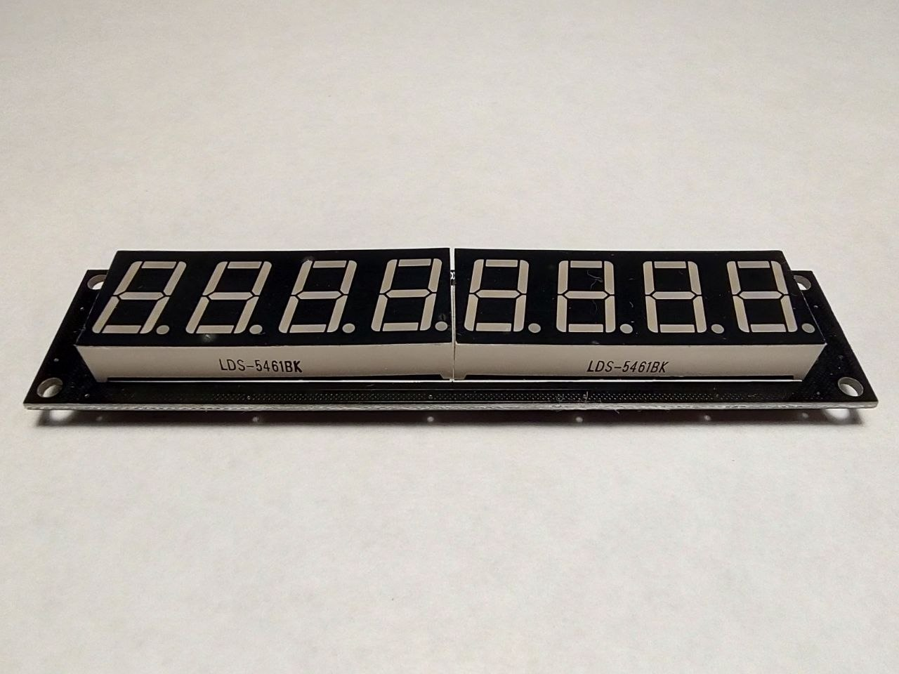
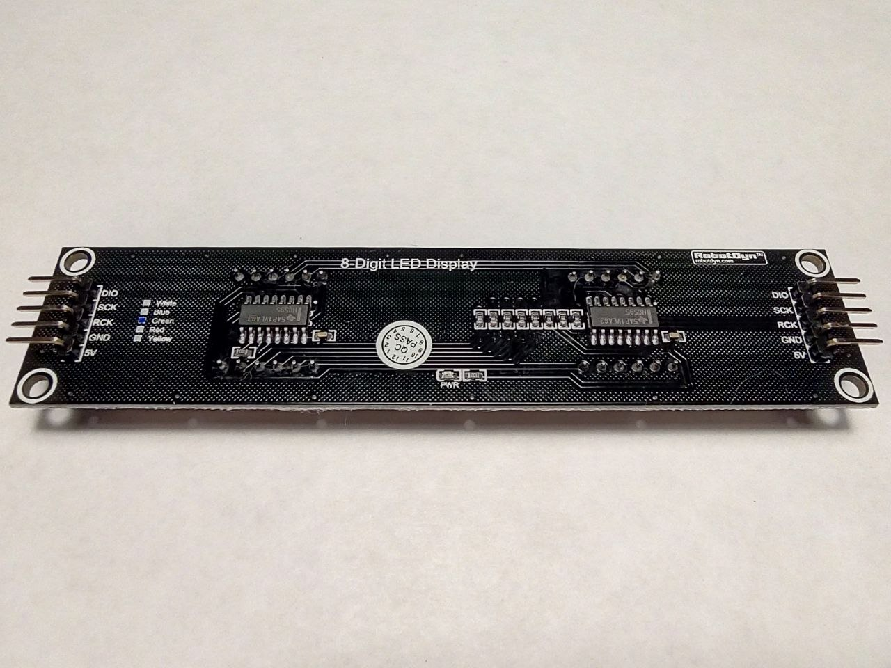
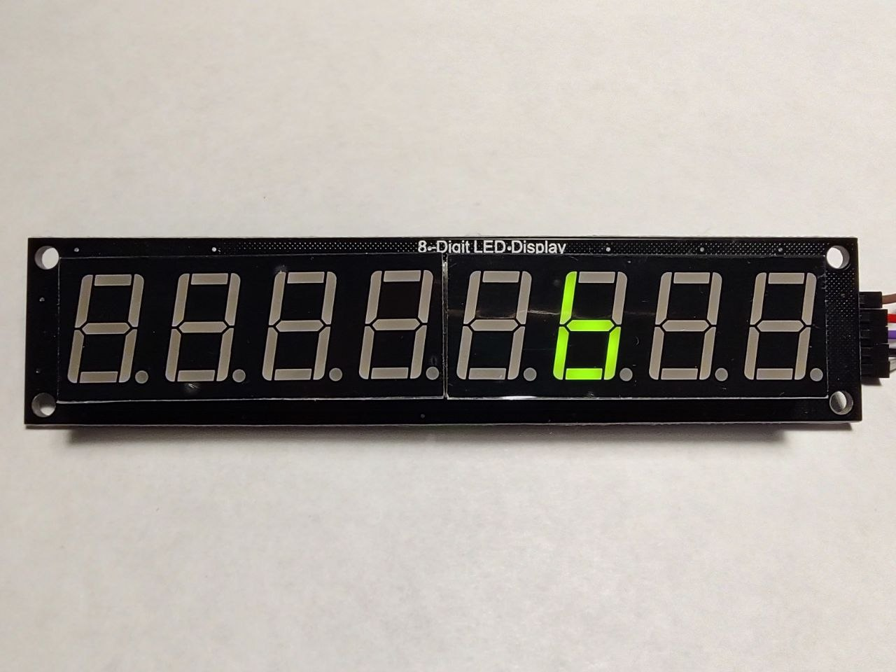

### Seven segment display and 74HC595

Some experiments with different combinations of seven segment displays and shift register.  

---

### Static lighting

- 4x one-digit seven segment dispalys and 4x shift registers:  

  

  

  

---

### Dynamic lighting (multiplexing)

- 2x four-digits seven degment dispalys and 2x shift registers:

  

  

  

