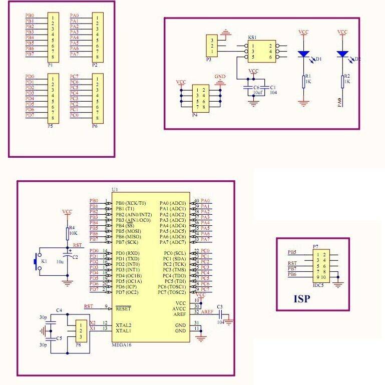

# ATmega1284

The ATmega1284 is a low-power, CMOS 8-bit microcontroller based on the AVR enhanced RISC architecture

As a minimalistic system development board you can use a YL-34 (ATmega16 ATmega32 compatible).  

YL-34 circuitry:  
  

See also:  
- [ATmega1284 | Microchip Technology](https://www.microchip.com/en-us/product/ATmega1284)  
- [ATmega164A/PA/324A/PA/644A/PA/1284/P | Data Sheet](https://ww1.microchip.com/downloads/aemDocuments/documents/MCU08/ProductDocuments/DataSheets/ATmega164A_PA-324A_PA-644A_PA-1284_P_Data-Sheet-40002070B.pdf)  
- [AVR Instruction Set Manual](https://ww1.microchip.com/downloads/aemDocuments/documents/MCU08/ProductDocuments/ReferenceManuals/AVR-InstructionSet-Manual-DS40002198.pdf)  

- [AVRDUDE - AVR Downloader/Uploader (old)](https://www.nongnu.org/avrdude/)  
- [AVRDUDE Online Documentation](https://avrdudes.github.io/avrdude/)  
- [AVRDUDE GIT repository](https://github.com/avrdudes/avrdude)  

- [AVR-LibC](https://avrdudes.github.io/avr-libc/)  

- [AVR® Fuse Calculator](https://www.engbedded.com/fusecalc/)  

